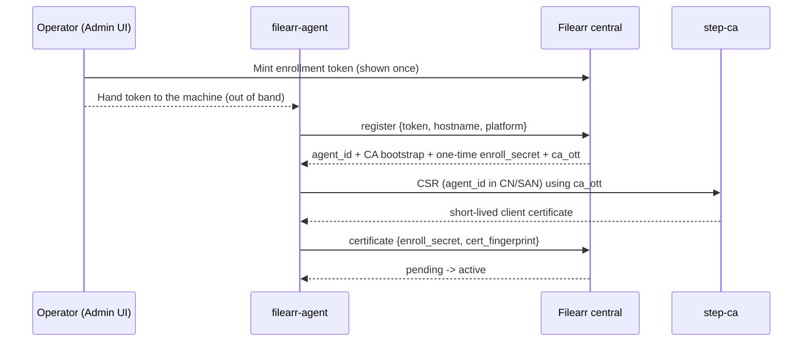

# Distributed agents

Filearr can coordinate a fleet of **distributed agents**: a small companion
program on each remote machine that scans *that host's* local disks, keeps a
**local, offline-usable** index, and replicates lightweight file-change events up
to the central server over mTLS.

!!! info "Agents are opt-in and off by default"
    A single-node Filearr deployment is entirely unaffected by any of this. With
    `FILEARR_AGENTS_ENABLED=false` (the default), the agent API returns 404, the
    Admin → Agents panel is hidden, and the certificate authority never runs. The
    tables still exist (empty), so enabling later needs no migration.

!!! tip "Looking for a specific setting?"
    [Agent settings reference](reference/agent-settings.md) enumerates all three
    configuration surfaces — central policy, the `FILEARR_AGENT_*` environment
    variables, and the `filearr-agent.json` sidecar — and states which one wins
    when the same thing is set in more than one place.

## What the agent is (and is not)

- **It is** an offline-first local catalog plus a reliable, at-least-once,
  idempotent replication client. Local search answers "where did I put that
  file" using path / size / mtime / hashes / filename-derived title.
- **It can also extract**, on its own machine, when policy turns it on: the
  agent runs the extraction pass locally and attaches the result to its change
  events. Central never opens a file on a remote host — extraction either
  happens *on the agent* or not at all for that item.
- **It is not** the place heavy or exotic extraction lives. Central remains the
  single source of truth; the agent's local index is disposable and rebuildable
  from a filesystem walk, exactly as Meilisearch is one level up.

The agent is a single static Go binary (no cgo), cross-compiled for Windows,
macOS and Linux, using a pure-Go SQLite/FTS5 store.

### Content extraction on agent-owned libraries {#agent-extraction}

Extraction on agent libraries is **opt-in and host-dependent**. It is off until
you enable it, and what an agent can actually do depends on which tools exist on
*that machine*, not on which binary it runs.

!!! warning "Agent extraction is off by default, and capability is per host"
    Replication carries **identity only** — path, size, mtime, hashes, plus a
    filename-derived title — until you set `extract_enabled` in the agent's
    policy. With it on, the agent ships a compact `extracted` object alongside
    each change event and central folds it into the item's *extracted* metadata
    (never `user_metadata`).

    **What still cannot work:**

    - **Central-side extraction never runs for agent items.** Central cannot
      open a path on a remote host. If the agent did not extract it, nothing
      will — there is no retrieve-then-extract fallback.
    - **A capability the agent host lacks is silently unavailable.** OCR needs
      `tesseract`, the media technical probe needs `ffprobe`, deep EXIF needs
      `exiftool`, and PDFs need poppler-utils (`pdfinfo` for properties,
      `pdftotext` for text, `pdftoppm` to rasterise scanned pages for OCR).
      These are **host tools on `PATH`**, not compiled-in features:
      an operator upgrades an agent's capability by installing a package on the
      machine, not by swapping binaries. An agent asked to do something it
      cannot logs the ignored setting once and carries on — and the console
      shows you exactly which agents those are (below).
    - **Oversize extractions are dropped, not retried.** Central caps the whole
      `extracted` object at `FILEARR_AGENT_EXTRACTED_MAX_BYTES` (256 KiB). Over
      that, the object is discarded with a warning and the change event still
      applies — replication is never allowed to wedge on enrichment.
    - **Only new and changed files are extracted** by a scan. Items catalogued
      *before* you turned `extract_enabled` on, or before their host gained a
      tool, keep identity-only metadata — no scan will ever revisit them. Use
      the [Re-extract action](#agent-reextract) once to fill them in.
    - **A few formats stay out of reach.** The agent covers images, audio,
      video (via ffprobe), documents including PDF, archives and 3D geometry
      (`stl`/`obj`/`ply`/`off`/`gltf`/`glb`/`3mf`); other CAD and mesh formats
      report `unsupported`, exactly as central's own extractor does for them.
      The agent advertises the `formats` it can actually handle.

    **How to turn it on:** set `extract_enabled: true` in the
    [configuration group](#two-groupings) you want it in (Agents page → the
    group's **edit** dialog → *Extraction & privacy*), plus
    `extract_body_text` for document text, `extract_exif` for camera/GPS
    metadata, and `extract_ocr` where the hosts have tesseract. Groups layer
    **per key**, so a group only needs to state what differs from the layers
    below it. Then install the host
    tools on the machines that need them. Existing items pick the new metadata
    up on their next change event or the next full reconcile; RAG chunking and
    content embeddings follow automatically once `body_text` lands, because the
    backfills select on exactly that.

    **What worked all along**: filename/path/size/date search and facets, hashes
    and duplicate detection, move detection, on-demand stat/rehash verification,
    file retrieval (the agent streams the bytes on request), and thumbnails —
    which the agent generates itself and pushes to central, precisely because
    central cannot read the source.

#### Seeing what an agent can do {#agent-capabilities}

Each agent reports a **capability advertisement** on its command poll — whether
this build has the extraction pass (`extract`, `extract_schema`), which host
tools it found (`tools.ffmpeg` / `ffprobe` / `tesseract` / `exiftool` /
`pdfinfo` / `pdftotext` / `pdftoppm`), and the `formats` it can handle. The Agents table exposes it per row behind
**details**, together with the agent's effective content-extraction policy and,
most usefully, a list of the settings **this agent will ignore** — for example
an amber `extract_ocr — no tesseract on the agent host` chip when the policy
asks for OCR on a machine that has none. The check is deliberately conservative:
an agent that has not yet advertised anything is reported as unknown rather than
flagged.

Each tool chip also shows the **version** found there and whether it clears the
minimum Filearr recommends — see
[Minimum recommended versions](#agent-tool-minimums) for the numbers, the
reasoning behind each one, and what an amber chip is asking you to do.

The chips are the at-a-glance view. For the detailed one — the agent's build
stack, its Go module dependencies, and each host tool's version *and resolved
path* — open **About / versions** in the same details panel; see
[The per-agent About view](#agent-about).

#### Host tools: what each one buys {#agent-host-tools}

Every one of these is optional. Install only what the libraries on *that* host
need — the agent re-detects on start, and the console's matrix confirms it.

| Tool | Unlocks | Without it |
| --- | --- | --- |
| `ffprobe` (ffmpeg) | Video and audio technical probe: container, codecs, resolution, duration, bitrate, frame rate, HDR, sample rate, channels | Video items carry identity only; audio keeps its tags but loses duration/bitrate |
| `exiftool` | Deep EXIF: camera make/model, lens, ISO, exposure, aperture, focal length, GPS — plus the flat `camera`/`taken_at` fields. **Also needs `extract_exif` in the policy**, which is off by default | Images keep width/height/format/mode from the file header |
| `pdfinfo` (poppler-utils) | PDF page count, title/author/subject/creator/producer, created/modified, encryption flag | PDFs carry identity only |
| `pdftotext` (poppler-utils) | PDF body text — the input to RAG chunking and content embeddings | PDFs are searchable by name only |
| `pdftoppm` (poppler-utils) | Scanned-PDF OCR (rasterise, then tesseract) | Image OCR still works; scanned PDFs are skipped |
| `tesseract` | OCR of images and scanned pages | No OCR anywhere on that host |
| `ffmpeg` | Video poster-frame thumbnails (pre-existing capability) | Video items fall back to the placeholder icon |

##### Minimum recommended versions {#agent-tool-minimums}

Installed is not the same as good enough. A host running **tesseract 4.1.1** and
one running 5.3.4 both answer "yes, OCR works here", and only one of them is
running an engine upstream still maintains. So each agent's chip carries a
**verdict** as well as a version, and central — not the agent — decides it, which
is why a revised minimum needs a Filearr release rather than a fleet-wide agent
rollout.

| Tool | Minimum | Why that number | Below it |
| --- | --- | --- | --- |
| `ffprobe` | **4.3** | The first release where the Dolby Vision configuration record is a reportable side-data type (`AV_PKT_DATA_DOVI_CONF`, added 2020-04-22) | DV and some HDR side data are never mentioned, so those videos are indexed as ordinary SDR files with nothing to say anything was missed |
| `ffmpeg` | **4.3** | Ships with ffprobe and is upgraded with it; also clears AV1 decoding via libdav1d (added in 4.1) | Newer codecs such as AV1 cannot be decoded, so those videos get the placeholder icon instead of a poster frame |
| `tesseract` | **5.0.0** | 4.1.3 was the **final** 4.x release (2021-11-15); 5.0.0 arrived a fortnight later and every engine fix since has landed only there. 5.0 also moved LSTM inference to 32-bit floats with wider SIMD | OCR runs on an engine line abandoned in 2021 — slower, heavier, and missing four years of recognition and crash fixes. (The neural engine itself arrived in 4.0, so a 4.1 host is not *bad* at OCR; it is frozen) |
| `exiftool` | **12.24** | Security: **CVE-2021-22204** lets a crafted image execute arbitrary Perl (7.44 → 12.23), fixed in 12.24 | A malicious file anywhere in a scanned library can run code as the user running the extractor |
| `pdftotext`, `pdftoppm` | **22.09.0** | Security: **CVE-2022-38784**, an integer overflow in libpoppler's JBIG2 decoder (≤ 22.08.0), fixed in 22.09.0 — and both binaries decode untrusted page content | A crafted PDF can crash the extractor or execute code |
| `pdfinfo` | **22.09.0** | The same poppler package version as the two above. pdfinfo itself only reads the document catalogue, so this is a **package-version proxy**, not a claim that pdfinfo is the exploitable binary | The host's poppler is older than the JBIG2 fix, which means `pdftotext`/`pdftoppm` on that machine are vulnerable |

**What the console shows.** Every tool on the Agents page (and on
**About → Extraction tools on this server**, which judges *central's* own tools
by the same rule) carries one of four verdicts:

| Verdict | Looks like | Means |
| --- | --- | --- |
| `ok` | green | Installed, and its version meets the minimum above |
| `outdated` | **amber**, with `⚠` | Installed and demonstrably below the minimum. Hover for the version found, the version wanted, and what it costs |
| `unknown` | grey | Installed but not judgeable — it reported no version, or its version has no comparable number in it. **Not a problem.** An `ffmpeg` built from git (`N-113579-g1c2d3e4`) lands here, and it is usually *newer* than any release, so Filearr says so instead of guessing |
| `absent` | grey, with `✕` | Not installed |

Nothing is ever *blocked* by a minimum: an outdated tool keeps working and keeps
extracting. The verdict exists so that "the OCR on this one host is oddly bad" is
a thing you can see rather than a thing you have to suspect.

Fixing an amber chip is a **host** package upgrade — no new agent build, no
re-enrollment. The installers below can do it: they go through the platform
package manager, so re-running one picks up whatever the host's repositories
currently offer. Where a distribution's repository is itself pinned to an old
release (Ubuntu 22.04 still ships tesseract 4.1.1), the upgrade needs a newer
distribution, a backports/PPA repository, or one of the direct downloads listed
further down.

##### The installer does this for you {#agent-tools-autoinstall}

**The install scripts fetch these by default**, so in the normal case there is
nothing to do:

```bash
# Linux / macOS — tools installed unless you pass -T
curl -fsSL https://filearr.example.com/api/v1/agent-dist/install.sh | sh -s -- -t <token>
curl -fsSL https://filearr.example.com/api/v1/agent-dist/install.sh | sh -s -- -t <token> -T
```

```powershell
# Windows — tools installed unless you pass -SkipTools
.\install-agent.ps1 -Token <token>
.\install-agent.ps1 -Token <token> -SkipTools
```

They install through the **platform package manager and nothing else** —
apt/dnf/zypper/pacman/apk, Homebrew, or winget. That is a deliberate limit: the
alternative is downloading third-party archives of executables, which would make
the installer a distributor of arbitrary binaries and put hash and signature
verification on us for four tools across three platforms. Package managers
already do that against signed repositories. Where none is available the script
prints the links below and carries on — **a tool that fails to install never
fails the agent install**, because extraction is opt-in and an agent with no
tools is a perfectly good inventory agent.

##### Installing them yourself {#agent-tools-manual}

```bash
# Debian/Ubuntu
sudo apt install ffmpeg poppler-utils libimage-exiftool-perl tesseract-ocr
# Fedora/RHEL
sudo dnf install ffmpeg poppler-utils perl-Image-ExifTool tesseract
# Arch
sudo pacman -S ffmpeg poppler perl-image-exiftool tesseract tesseract-data-eng
# Alpine
apk add ffmpeg poppler-utils exiftool tesseract-ocr tesseract-ocr-data-eng
# macOS (Homebrew — never run as root)
brew install ffmpeg poppler exiftool tesseract
# Windows — --scope machine is REQUIRED, see the warning below
winget install --id Gyan.FFmpeg --scope machine
winget install --id oschwartz10612.Poppler --scope machine
winget install --id OliverBetz.ExifTool --scope machine
winget install --id UB-Mannheim.TesseractOCR --scope machine
```

!!! warning "Windows: install machine-wide, or the agent will not use it"
    The Windows agent runs as a service under **LocalSystem**, and it only ever
    discovers host tools on the **machine `PATH`** or under **`C:\Program
    Files`** (including the machine WinGet link and package directories) — the
    only conventional location non-administrators cannot write. A tool installed
    into a **user profile** (`%LOCALAPPDATA%`) is **ignored on purpose**:
    executing a binary out of a user-writable directory as SYSTEM would let any
    local user drop their own `exiftool.exe` there and have it run with full
    privileges. The *"Not on PATH? The agent looks anyway"* note below states
    the full rule and the two escape hatches for a tool installed elsewhere.

    This matters because **`winget` defaults to user scope** when you do not say
    otherwise. The symptom is unmistakable: the tool runs fine in your terminal,
    and the agent's chip in the console says `✕`. It is not a detection bug — the
    agent is declining to run a binary out of your profile.

    The fix is either re-running `manage-windows-agent.ps1` (it now checks
    presence the way the *service* sees it, and reinstalls anything missing with
    `--scope machine`), or the `winget --scope machine` commands above from an
    **elevated** shell — machine scope requires admin. A user-scope copy you
    already have is left alone; it may still win in your own terminal, so
    `Get-Command exiftool` can report a different path than the agent uses. A
    newly installed machine-wide tool appears in the console **within about 15
    minutes** without a restart (see
    [When a newly installed tool shows up](#agent-tool-freshness)); the manage
    script restarts the service anyway, which makes it immediate.

Direct downloads, when a package manager is not an option:

| Tool | Download | Notes |
| --- | --- | --- |
| ffmpeg / ffprobe | [gyan.dev](https://www.gyan.dev/ffmpeg/builds/) (Windows) · [BtbN releases](https://github.com/BtbN/FFmpeg-Builds/releases) (Windows/Linux) · [johnvansickle.com](https://johnvansickle.com/ffmpeg/) (Linux static) · [osxexperts.net](https://osxexperts.net/) (macOS) | The "essentials" build is enough — Filearr only needs `ffprobe` for metadata and `ffmpeg` for poster frames. **Never use an `--enable-nonfree` build**: ffmpeg.org states those are not redistributable. |
| poppler | [oschwartz10612/poppler-windows](https://github.com/oschwartz10612/poppler-windows/releases) | Windows releases unpack to a **versioned** folder (`poppler-24.02.0\Library\bin`). The agent globs for that, so you do not have to rename it. |
| exiftool | [exiftool.org](https://exiftool.org/) | The Windows zip ships `exiftool(-k).exe` — **rename it to `exiftool.exe`** or it pauses for a keypress and the extraction pass hangs on it. |
| tesseract | [UB-Mannheim builds](https://github.com/UB-Mannheim/tesseract/wiki) (Windows) · [tesseract-ocr/tessdata_fast](https://github.com/tesseract-ocr/tessdata_fast) (extra languages) | The installer **does not add itself to `PATH`** — see the note below. Extra languages are ~4 MB each from `tessdata_fast`; the "best" models are ~23 MB each and rarely worth it here. |

!!! tip "Not on PATH? The agent looks anyway"
    A service does not inherit your shell's `PATH` — a Windows service gets the
    machine environment, and a launchd job famously lacks Homebrew's
    `/opt/homebrew/bin`. Combined with installers that never touch `PATH` (the
    Tesseract one does not), the classic symptom is "it works in my terminal and
    the console says not installed".

    So when `PATH` misses, the agent also probes the conventional locations. On
    **Windows those are under `C:\Program Files` (and `C:\Program Files (x86)`)
    and nowhere else**: `Tesseract-OCR`, `ExifTool`, `ffmpeg\bin`, versioned
    `poppler-*\Library\bin`, and the machine winget link and package
    directories. On macOS and Linux: `/opt/homebrew/bin`, `/usr/local/bin`,
    `/opt/local/bin`, `/snap/bin` and the system-wide Nix/Flatpak paths.

    **Why Program Files only.** The Windows agent runs as **LocalSystem**, and
    Program Files is the only conventional Windows location whose default
    permissions deny writes to non-administrators. `C:\` and `C:\ProgramData` let
    any signed-in user *create* a subdirectory, so a well-known path there that
    does not exist on your machine yet — say `C:\ffmpeg\bin` — could be created
    and filled by a non-admin and then run with SYSTEM privileges. Directories
    like `C:\ProgramData\chocolatey\bin`, the Scoop shims, `C:\ffmpeg\bin` and
    `C:\exiftool` are therefore **not** auto-probed. Nothing under a home
    directory or `%LOCALAPPDATA%` is probed on any platform either, for the same
    reason.

    **This almost never costs you anything**, because the **machine `PATH` is
    searched first** and every package manager that owns a shim directory
    (Chocolatey, Scoop, winget) puts it on the machine `PATH` when it installs
    itself. A Chocolatey or Scoop install still resolves normally.

    **If your tool is somewhere else** — a hand-unpacked `C:\ffmpeg\bin`, a
    Scoop install whose shims are not on the machine `PATH`, anything unusual on
    any platform — you have two supported options, and both are one-time:

    1. **Add its directory to the machine `PATH`** (System → Environment
       Variables → *System variables* → `Path`, not the user section), then
       restart the agent service; or
    2. **Set that tool's path override**, an environment variable naming the
       binary or its directory entry:
       `FILEARR_AGENT_FFMPEG_PATH`, `FILEARR_AGENT_FFPROBE_PATH`,
       `FILEARR_AGENT_TESSERACT_PATH`, `FILEARR_AGENT_EXIFTOOL_PATH`,
       `FILEARR_AGENT_PDFINFO_PATH`, `FILEARR_AGENT_PDFTOTEXT_PATH`,
       `FILEARR_AGENT_PDFTOPPM_PATH`. An override **wins over everything**,
       including `PATH` — it is the explicit, operator-chosen escape hatch, and
       it is not subject to the Program Files rule because you chose it
       deliberately. Set it as a **machine** variable so the service sees it.

    Easiest of all: move or reinstall the tool under `C:\Program Files` (for
    winget, `winget install --id <Id> --scope machine` from an elevated shell).

**Which install gets what.** The **container agent ships all of them** — ffmpeg,
poppler-utils, exiftool and tesseract with English data — so a containerized host
has no capability gaps and nothing to install. A **binary or service install**
(the Windows service, a hand-placed binary) ships **none** of them: the agent is
a single static executable and every tool above is a *host* program it shells out
to. That is why the installers fetch them, and why nothing is bundled into the
agent download: bundling all four would add roughly 246 MB on Windows, 176 MB on
Linux and 88–113 MB on macOS to a 35.8 MB binary, and would make each release a
redistribution of GPL binaries with the licence obligations that carries.

**Verifying what an agent actually found.** The agents table shows each tool as a
chip with its **detected version** — `tesseract 5.3.4`, `ffmpeg 6.1.1-3ubuntu5` —
so you can confirm not just that a tool is present but that it is the build you
expect (a tesseract 4 reads scans materially worse than a 5.x, and "installed" on
Windows often means a years-old zip). A chip showing `✓` without a version means
the tool is there but did not report one; `✕` means it is not on `PATH` at all.
The same matrix, with versions, appears on the agent's own local status page and
is printed by `filearr-agent install`.

##### The per-agent About view {#agent-about}

The chips answer *what can this agent do*. Open **details → About / versions**
for the other question — *what exactly is installed over there*. It is the
per-agent counterpart of the console's own **About** page, and it shows three
things:

**The build stack.** The agent version, the **Go toolchain that compiled the
binary** (labelled "built with" — that is the compiler, not the `go` directive
in `go.mod`, and the two differ routinely), the platform it was built for, the
host **OS version**, and the source commit with a `(modified)` marker when the
working tree was dirty at build time. The host OS line is often the whole
explanation for an outdated host tool: the distribution is what pins the
package.

**Host tools, with version *and* location.** One row per tool: the version found,
the **absolute path it resolved from**, and the verdict. The path is the answer
to *which copy* — a machine can easily carry three ffmpegs, and "installed" does
not say which one the service will execute. It is also the visible proof of the
machine-wide-only rule described above: **a path here should never sit under a
user profile**, and the console flags one in red if it ever does, because that
would mean the agent had resolved a binary out of a user-writable directory
while running as SYSTEM/root.

A verdict of `unknown` is a judgement of **"unjudged", not "bad"**. It means the
tool is installed but could not be measured — it reported no version, its version
has no comparable number in it (an ffmpeg built from git), or Filearr publishes
no minimum for it. Only `outdated` is a warning, and only ever after an actual
numeric comparison of two parseable versions.

**Go module dependencies.** Every module linked into the agent binary, with a
link to its `pkg.go.dev` page. A Go binary is statically linked, so this list *is*
what is running — not a manifest of what a build was asked for. It is the answer
to "does any agent in this fleet ship a vulnerable version of *x*". The table is
collapsed by default because it runs to well over a hundred rows. If it says
**"not reported (payload budget)"**, the agent deliberately left the list out to
keep its status poll small; the agent's own local web UI shows it in full, since
nothing crosses a network to reach that page.

Everything on the panel is **self-reported**. Central never queries an agent —
agents poll — so the panel leads with a *Reported* timestamp, and on a machine
that has been offline for a week those numbers are a week old while looking
perfectly current. An agent that has never polled says so plainly rather than
rendering a page of zeros. **Copy as Markdown** dumps the whole report,
timestamp included, for pasting into a bug report.

The view needs the **admin** scope — deliberately narrower than the server About
page's `read`, because it exposes filesystem paths from someone else's machine.

##### When a newly installed tool shows up {#agent-tool-freshness}

**Within about 15 minutes, with no service restart.** The agent caches its tool
lookups (a scan asks per file, so the cache is not optional), but each entry
expires after 15 minutes, and the capability report is rebuilt on every poll.
Install a tool machine-wide and the console reflects it by itself. If you are
impatient, restarting the agent works and is instant.

Each tool also honours an explicit path override, which wins over `PATH`:
`FILEARR_AGENT_FFMPEG_PATH`, `FILEARR_AGENT_FFPROBE_PATH`,
`FILEARR_AGENT_TESSERACT_PATH`, `FILEARR_AGENT_EXIFTOOL_PATH`,
`FILEARR_AGENT_PDFINFO_PATH`, `FILEARR_AGENT_PDFTOTEXT_PATH`,
`FILEARR_AGENT_PDFTOPPM_PATH`.

The **container agent ships all of them** — ffmpeg, poppler-utils, exiftool and
tesseract with English data — so a containerized host has no capability gaps and
nothing to install. None of them run unless a policy enables extraction. Extra
OCR languages are a one-line derived image:

```dockerfile
FROM ghcr.io/pwsh/filearr-agent:latest
RUN apk add --no-cache tesseract-ocr-data-deu
```

## Installing the agent (service + sidecar config)

The recommended install path starts from the **Agents page** in the central
console (`#/agents`): the *Enrollment & installer* card mints an enrollment
token and generates a ready-to-use `filearr-agent.json` **sidecar config** —
a plain, user-editable JSON file the agent picks up during install:

```json
{
  "central_url": "https://filearr.example.com",
  "enrollment_token": "fae_…",
  "agent_name": "",
  "config_group_names": ["office-workstations"],
  "config_group": "office-workstations",
  "log_level": "info"
}
```

`config_group_names` is the full list of [configuration
groups](#two-groupings) the machine joins at enrollment (Global is implicit and
never listed). `config_group` repeats the first name because shipped agent
binaries parse exactly that key — leave both in place unless you are certain
every machine runs a build that reads the list.

**One-command install (recommended):** your central serves the agent binaries
for every platform itself (`/api/v1/agent-dist` — baked into the Docker image,
sha256-verified by the scripts, no GitHub access needed). Save the sidecar
into a folder and run, from that folder:

```bash
# Linux / macOS
curl -fsSL https://filearr.example.com/api/v1/agent-dist/install.sh | sh
```

```powershell
# Windows (elevated PowerShell)
irm https://filearr.example.com/api/v1/agent-dist/install.ps1 -OutFile install-agent.ps1
.\install-agent.ps1
```

No sidecar saved yet? Pass the enrollment token directly — the script writes a
minimal sidecar for you: `... | sh -s -- -t <token> [-n <name>]` on
Linux/macOS, `.\install-agent.ps1 -Token <token> [-Name <name>]` on Windows.
The scripts detect OS/arch, download the matching binary, verify its sha256
against the manifest, and hand off to the installer below. (`-d` /
`-DownloadOnly` fetches the binary without installing the service.)

### One-script Windows lifecycle (provision / update / reconfigure) {#windows-scripts}

The install script above still needs a token minted in the console first. For
zero-console automation, **your central serves a single lifecycle script,
pre-configured with its own URL** (also shown on the Agents page's installer
card; the repository copy at
[`scripts/manage-windows-agent.ps1`](https://github.com/pwsh/filearr/blob/main/scripts/manage-windows-agent.ps1)
is identical but needs `-CentralUrl`):

```powershell
irm https://filearr.example.com/api/v1/agent-dist/manage-windows-agent.ps1 `
    -OutFile manage-windows-agent.ps1
```

Run it from an **elevated** PowerShell; it auto-detects what the machine
needs:

- **Agent not installed → provision.** Mints an enrollment token through
  `POST /api/v1/agents/enrollment-tokens`, downloads + sha256-verifies the
  binary from agent-dist, installs the auto-start `filearr-agent` service
  (enrolls non-interactively), and applies the configuration switches.
- **Agent installed → update + reconfigure.** Compares `filearr-agent
  --version` against the agent-dist manifest and swaps the binary under a
  stopped service when they differ (previous binary kept as `.old` for manual
  rollback; `-Force` reinstalls regardless), applying configuration changes
  in the same window. With nothing to do, it says so and exits.

```powershell
# fresh machine: provision with scan locations (auth-off central — no key)
.\manage-windows-agent.ps1 -ScanRoot D:\media -ScanRoot E:\photos

# authenticated central: minting is an admin operation
.\manage-windows-agent.ps1 -ApiKey <admin key> -ScanRoot D:\media

# later, same machine: update to whatever central serves now
.\manage-windows-agent.ps1

# migrate to mTLS (± an update in the same run) — the per-machine half of
# the mode-flip runbook
.\manage-windows-agent.ps1 -MtlsUrl https://agents.example.com
```

Switches work on both paths: `-ScanRoot` (repeatable) merges into the
service's `scan.json` (presets/globs you added survive) and `-MtlsUrl`
rewrites the sidecar's `central_url` to the mTLS site — enrollment always
runs against the main URL (the mTLS site refuses clients without a
certificate yet), and the enrolled agent presents its client certificate
automatically after the switch. `-Name`, `-ConfigGroup` (repeatable — the
[configuration groups](#two-groupings) the machine joins; Global is implicit)
and `-TokenTtlMinutes` cover the rest of the mint surface.

!!! note "How the URL switch takes effect"
    The daemon adopts the configured central URL at startup, outranking the copy
    `state.json` recorded at enrollment (the log shows *"central URL switched by
    config"*). Switching the URL and updating the binary in the same run is fine
    — the binary updates first, and the new binary reads the switched sidecar
    when the service starts.

Downloads always ride `agent-dist`, the deliberately-unauthenticated
first-install surface, so updates never *require* a key — `-ApiKey` is sent
on every request for deployments that front central with an authenticating
proxy. As an updater this is the operator-driven complement to the built-in
[self-update channel](#self-update-with-signed-releases): use it for
key-pinned builds central won't offer unsigned bits to, machines with
self-update disabled, or an immediate "update now" from a shell.

**Manual install:** download the platform binary from
`<central>/api/v1/agent-dist` (the manifest lists every platform with its
sha256) and put it beside the sidecar in one folder, then (as admin/root):

```bash
filearr-agent install --config filearr-agent.json
```

`install` copies the binary into the platform's install location
(`%ProgramFiles%\Filearr Agent` on Windows; `/usr/local/bin` with config in
`/etc/filearr-agent`, data in `/var/lib/filearr-agent`, and logs in
`/var/log/filearr-agent` on Linux), enrolls non-interactively when a token is
present, and registers an **auto-starting system service with
restart-on-failure** (Windows SCM, systemd, or launchd). Re-running `install`
upgrades in place; `filearr-agent uninstall` removes the service and binary
(`--purge` also removes data/logs/config); `filearr-agent service
status|start|stop|restart` manages it day to day.

If the host previously ran the agent **manually** (identity under the user's
config dir, e.g. `%AppData%\Roaming\filearr-agent`), `install` **adopts** that
enrollment: the identity, local index, outbox, and scan config are copied into
the system data dir so the service continues seamlessly — no re-enroll, no
rescan, replication sequence preserved (the per-user copy is left untouched).
Install also **verifies the service actually stays running** and fails with
guidance if it exits immediately, instead of printing a success banner over a
dead service.

Service start reports **running immediately** and finishes initialization in
the background — necessary because the first start after an upgrade may
rebuild local database indexes over the whole catalog, which can take minutes
on a large index, longer than the Windows SCM's 30-second start budget. The
agent log carries an "opening local index" line while that runs; a fatal
init failure (bad data dir, unreadable index) logs and exits nonzero so the
service manager's restart/recovery policy applies.

The enrollment token in the sidecar is **one-shot**: after a successful
enroll the file is rewritten with the token removed and a consumption
timestamp in its place. Every other field stays user-editable; explicit CLI
flags and environment variables override sidecar values.

Logging is definable per install or per configuration group:
`error`, `warn`, `info`, `verbose`, `debug` — with rotating file logs
(10 MiB × 5, compressed) in the platform log directory.

## Running the agent in Docker (Unraid)

For NAS boxes — Unraid first among them — the agent also ships as a
standalone container: `ghcr.io/pwsh/filearr-agent`. The image bundles the
static agent binary, `ffmpeg` (for video poster thumbnails), and an
entrypoint that enrolls on first start, then runs the replication daemon
alongside interval rescans of your mounted shares.

!!! info "Why interval rescans, not watch mode"
    Unraid's `/mnt/user` is a FUSE (shfs) mount where inotify is unreliable —
    the same caveat that applies to SMB/NFS everywhere in Filearr. The
    container therefore re-walks its roots on a timer (default every 6 h;
    `FILEARR_AGENT_SCAN_INTERVAL`). Rescans are mtime+size cheap: unchanged
    files cost a `stat`, nothing more.

### Unraid setup

A Community Applications template ships in the repo
(`unraid/filearr-agent.xml`). Three fields matter on first start:

1. **Central URL** — your Filearr server (`https://filearr.example.com`).
2. **Enrollment token** — mint one in the console (Agents → *Mint token*);
   it is single-use and short-lived. After the log shows `enrolled.` the
   identity lives in appdata and the token field can be cleared.
3. **Scan roots** — comma-separated directories to inventory. Prefer listing
   specific shares (`/mnt/user/media,/mnt/user/documents`) over all of
   `/mnt/user`, which drags appdata/system churn into the catalog.

The template mounts `/mnt/user` **read-only and 1:1** (container path equals
host path), so the paths central records are your real Unraid paths — no
remote-path-mapping needed. If you narrow the mount to one share, keep it 1:1
(`/mnt/user/media` → `/mnt/user/media`) to preserve that property. The agent
runs as `PUID`/`PGID` 99/100.

!!! warning "Keep agent state OFF the FUSE layer"
    Agent state (`/config`) holds a SQLite index + replication outbox. Point
    it at a **cache-pool path** (`/mnt/cache/appdata/filearr-agent`, the
    template default) or an exclusive share — SQLite accessed through
    `/mnt/user`'s shfs/FUSE layer produces `database is locked` stalls.

**Share Map** (recommended): the container cannot discover your SMB exports
(there's no `smb.conf` inside it, and its hostname isn't your NAS's), so tell
it how each root is shared — one `localpath=location` pair per root:

```text
FILEARR_AGENT_SHARE_MAP=/mnt/user/media=smb://TOWER/media,/mnt/user/documents=smb://TOWER/documents
```

Central then renders clickable network-open links (`smb://` or `\\TOWER\…`,
per the viewer's OS) for every file this agent replicates. UNC and `nfs://`
locations work too; the longest matching prefix wins per file.

**Local web UI**: the template maps port 8686 and sets
`FILEARR_AGENT_WEBUI_ALLOW_REMOTE=true` (a loopback-only listener would be
unreachable through a Docker port mapping). It stays read-only search and is
**centrally gated** — enable *Local web UI* under **Local surface** in a
[configuration group](#two-groupings) the container's agent belongs to (the
**Global** group for the whole fleet, a higher-priority group for just these
hosts) or it serves nothing. Self-update is off inside the
container (`FILEARR_AGENT_SELF_UPDATE=false` in the image): updating means
pulling a new image.

### Any other container host

```yaml
services:
  filearr-agent:
    image: ghcr.io/pwsh/filearr-agent:latest
    restart: unless-stopped
    environment:
      FILEARR_AGENT_CENTRAL_URL: https://filearr.example.com
      FILEARR_AGENT_TOKEN: "<single-use token>"   # remove after first start
      FILEARR_AGENT_NAME: nas-01
      FILEARR_AGENT_SCAN_ROOTS: /srv/media
    volumes:
      - ./agent-data:/config
      - /srv/media:/srv/media:ro
```

All `FILEARR_AGENT_*` environment variables pass straight through to the
binary; the data directory is pinned to `/config`.

!!! warning "Container updates replace self-update"
    The image ships with `FILEARR_AGENT_SELF_UPDATE=false`: the signed
    self-update channel is off (an image is immutable by design). Update by
    pulling the new image; the enrolled identity and local index in
    `/config` carry over.

!!! note "The agent web UI is a small console"
    Five read-only tabs: **Search** (category chips, sorting, CSV/JSON
    export), **Filters** (a filter builder over the same query grammar as
    the central console, with live preview), **Reports** (categories,
    unmapped extensions, largest files, duplicates, future-dated files —
    with CSV download), **Status** (agent version and a per-root table of
    items/size/last-scan statistics), and **Logs** (columnar
    time/level/message/details view with export).

!!! note "Web UI logs are the full multi-process log"
    The image sets `FILEARR_AGENT_LOG_DIR=/config/logs`: the daemon, every
    scan invocation, and the entrypoint each write a rotating log file
    there, and the web UI **Logs** tab merges them into one
    timestamp-ordered view (selectable depth, up to 5,000 lines back, via
    `/api/logs?limit=N`). `docker logs` continues to carry the same lines.

!!! tip "Poison files on network mounts"
    A corrupt or locked file on a FUSE/SMB/NFS mount can block reads
    forever, which would otherwise freeze a scan at the same file every run.
    Hashing is bounded per file by `FILEARR_AGENT_HASH_TIMEOUT_SECONDS`
    (default `300`, `0` disables): past the budget the file is cataloged
    unhashed and a WARN in the agent log names the path so you can repair or
    exclude it.

## Configuration groups and layering {#two-groupings}

Everything central configures on an agent arrives through **configuration
groups**. A group is a row you create: a name, an integer **priority**, and two
document sections (`settings` and `policy`). Every agent belongs to the
permanent **Global** group plus as many other groups as you put it in, and
central resolves that set into one document, key by key, on every poll.

Three rules cover the whole model.

1. **Global applies to everyone.** It is a system group — priority `0`, name and
   priority immutable, undeletable — and membership is implicit: no agent is
   ever added to it or removed from it. It is the fleet-wide baseline every
   other group layers on top of.
2. **Groups apply in ascending `(priority, name)` order, and a later group wins
   *per key*.** Not per document. A group whose `policy` is
   `{"extract_ocr": false}` changes exactly that one key; every other key keeps
   whatever the layers below supplied. Equal priorities are legal and break the
   tie by name, so you never have to renumber a fleet to insert a group.
3. **An agent can be in many groups.** Membership is a plain set (Agents table →
   the agent's detail row, or `PUT /api/v1/agents/{id}/config-groups`), so
   "Windows desktops" and "low-powered machines" are two groups you *compose*
   rather than one `windows-desktops-lowpower` group you maintain by hand.

### The two sections of a group

| Section | Unknown keys | What lives there |
| --- | --- | --- |
| `settings` | **rejected with 422** | Log level, scan selections, inventory collectors and their permissions block, `scan_schedule_cron`, and the three local-surface gates. [Group settings schema](#group-settings-schema) |
| `policy` | **preserved verbatim** | Extraction, watch mode, scan schedule, path scope, poll cadence, the local self-administration permissions, `auto_update`. [Every policy key](#every-policy-key) |

The split is about which validator runs, not about what the setting means. The
console's group dialog presents both by topic — *General*, *Scanning*,
*Inventory*, *Extraction & privacy*, *Local surface*, *Advanced* — so you rarely
have to know which half a field lands in. It matters in exactly two places:

- a typo in `settings` is a 422, while a typo in `policy` is stored and shipped.
  That permissiveness is deliberate — it is what lets a newer agent build read a
  key this central release has never heard of;
- three keys exist in both — `web_ui_enabled`, `local_access_enabled`,
  `auth_required`. **The `settings` value wins** when a group sets both, because
  `settings` is the typed, checkbox-rendered half and `policy` is the raw-JSON
  escape hatch. A `null` in `settings` means "inherit" and overrides nothing.

!!! note "Merging is shallow, per section"
    Each section merges at its **top level**. A nested object — the `inventory`
    block, the `scan_selections` list — is replaced wholesale by the
    higher-priority group that sets it, never deep-merged. A group that wants to
    add one collector therefore states the whole `inventory` object it wants,
    not just the changed field. Half-merged lists are unexplainable in a console;
    replacement is the rule an operator can hold in their head.

!!! note "Editing a section replaces it; layering happens *across* groups"
    `PATCH`ing a group's `settings` or `policy` swaps that whole section for the
    body you send. Deep-merging on write as well would leave you unable to
    *unset* a key. Authoring is replace, resolution is layer.

### Worked example: desktops inventory, filers extract {#policy-group-example}

The question this answers: *"On user desktops I want to inventory files but not
capture GPS EXIF, and not run OCR/text extraction on low-powered machines. On
the filer I want all of it."*

Four groups, three of which say almost nothing.

**1 — Global (priority 0)** is the baseline. Everything you want to be true
*unless* something overrides it goes here, once — `PATCH` it onto the Global
group (`PATCH /api/v1/agents/config-groups/{global-id}`):

```json
{
  "policy": {
    "extract_enabled": true,
    "extract_body_text": false,
    "extract_ocr": false,
    "extract_exif": false,
    "extract_max_bytes": 33554432,
    "content_hash_max_bytes": 1073741824,
    "watch_mode": false,
    "scan_cron": "30 2 * * *",
    "poll_interval_seconds": 300,
    "local_access_enabled": true,
    "web_ui_enabled": false
  }
}
```

**2 — `desktops` (priority 100)** now needs *nothing*: Global already describes
a desktop. Create it anyway if you want somewhere to put desktop-only inventory
settings, or skip it entirely — an agent in no group but Global is fully
configured.

**3 — `filers` (priority 100)** states only the differences:

```bash
curl -X POST http://central:8000/api/v1/agents/config-groups \
  -H "Authorization: Bearer $ADMIN_KEY" -H 'Content-Type: application/json' \
  -d '{
        "name": "filers",
        "description": "File servers: full extraction",
        "priority": 100,
        "policy": {
          "extract_body_text": true,
          "extract_ocr": true,
          "extract_exif": true,
          "extract_max_bytes": 268435456,
          "content_hash_max_bytes": 0,
          "watch_mode": true,
          "scan_cron": "0 3 * * *",
          "poll_interval_seconds": 60,
          "web_ui_enabled": true
        }
      }'
```

**4 — `low-power` (priority 500)** is one key, and it is the reason layering
earns its keep:

```json
{ "name": "low-power", "priority": 500, "policy": { "extract_ocr": false } }
```

Put the two elderly filers in **both** `filers` and `low-power`. They get the
filers' body-text extraction, EXIF, watch mode and cadence, and OCR off —
without a fifth group that duplicates the filer document:

```bash
curl -X PUT http://central:8000/api/v1/agents/$AGENT_ID/config-groups \
  -H "Authorization: Bearer $ADMIN_KEY" -H 'Content-Type: application/json' \
  -d '{"group_ids": ["<filers-id>", "<low-power-id>"]}'
```

Resolution for that machine, in merge order:

| Key | Global (0) | `filers` (100) | `low-power` (500) | Effective |
| --- | --- | --- | --- | --- |
| `extract_enabled` | `true` | — | — | `true` (Global) |
| `extract_exif` | `false` | `true` | — | `true` (`filers`) |
| `extract_ocr` | `false` | `true` | `false` | `false` (`low-power`) |
| `poll_interval_seconds` | `300` | `60` | — | `60` (`filers`) |
| `local_access_enabled` | `true` | — | — | `true` (Global) |

`extract_exif: true` on the filers means `exiftool` runs there and GPS
coordinates reach central (where they stay hidden unless the library sets
`expose_gps`); the desktops never start that subprocess at all, because nothing
above Global turns it on for them.

!!! tip "State only what differs"
    A group should contain the keys that are *true about that group and not
    about the fleet* — layering supplies the rest. A group that repeats
    Global's values still works, but it silently pins them — a later edit to
    Global will not reach its members, and nothing on screen says why.

!!! warning "Priority ties resolve by name, so keep overrides above their base"
    Two groups at the same priority that both set a key resolve alphabetically,
    which is deterministic but not meaningful. Give a group that exists to
    *override* another a strictly higher priority — that is what `low-power`'s
    `500` is for.

### Checking one agent's effective configuration {#effective-config}

`GET /api/v1/agents/{agent_id}/effective-config` (admin scope) answers "what
does this machine actually have, and who said so". It is byte-identical to what
the agent's next poll would deliver, minus the server-injected
`taxonomy_version`, and it is strictly read-only — it stamps no `last_seen_at`
and emits no ETag, so inspecting an agent never perturbs its liveness signals.

```json
{
  "agent_id": "0198f0a1-…",
  "document": {
    "extract_enabled": true,
    "extract_exif": true,
    "extract_ocr": false,
    "poll_interval_seconds": 60,
    "group": { "log_level": "info", "scan_schedule_cron": "0 3 * * *" }
  },
  "generation": 412,
  "hash": "9f2c1ab4de07",
  "groups": [
    {"name": "Global",    "priority": 0,   "is_system": true,  "version_used": 7, "via_rollout": false},
    {"name": "filers",    "priority": 100, "is_system": false, "version_used": 3, "via_rollout": false},
    {"name": "low-power", "priority": 500, "is_system": false, "version_used": 2, "via_rollout": true}
  ],
  "provenance": {
    "policy.extract_enabled": {"group_name": "Global",    "version": 7},
    "policy.extract_exif":    {"group_name": "filers",    "version": 3},
    "policy.extract_ocr":     {"group_name": "low-power", "version": 2},
    "settings.log_level":     {"group_name": "Global",    "version": 7}
  },
  "confirmed_generation": 409,
  "last_seen_at": "2026-08-11T09:14:22Z"
}
```

Read it as four answers:

- **`groups`** is the merge order, lowest priority first, with the version of
  each group this agent is on. `via_rollout: true` means this agent's bucket is
  inside an active [phased rollout](#phased-rollouts) tier, so it is running a
  version the rest of that group has not received yet.
- **`provenance`** names the winning layer for every single key, as
  `"<section>.<key>"`. This is the answer to "I set that to `false`, why is it
  `true`" — the key names the group that outranked you.
- **`generation`** is the delivered version identity: the highest snapshot
  sequence across the contributing groups (see
  [Versions, history and rollback](#config-versions)). It is monotonic across
  the whole fleet, so it only ever moves forward.
- **`confirmed_generation`** is what the agent last echoed back after applying a
  document. Lower than `generation` means *published, not yet confirmed* — the
  agent is offline, or simply between polls.

The console renders exactly this in the agent's detail row: the merged document
grouped by section, a source badge (`filers v3`, with a marker when it arrived
via a rollout) on every key, the amber *not enforced yet* chips for fields no
shipped agent build reads, and the delivered-versus-confirmed generation pair.

## What a group configures {#configuration-groups}

A group's `settings` section carries the typed half of remote configuration,
delivered over the same policy channel as everything else (an edit invalidates
agent caches immediately): log level, scan selections, inventory settings, and
an optional scan schedule. Scan selections accept **predefined per-OS presets**
(`user-documents`, `user-media`, `user-profiles-full`, `downloads`,
`server-data`) or explicit path specs with environment-token expansion
(`%USERPROFILE%`, `$HOME`, `~`), multi-user globs (`/home/*/documents`), and
regex include/exclude filters — all expanded **on the agent**, never centrally.
Presets resolve real locations (Windows known folders — OneDrive-redirect
aware; Linux XDG `user-dirs.dirs`, locale-proof; macOS user folders) and exclude
system files, thumbnails, caches, and other junk by default. Cloud-placeholder
files (e.g. OneDrive online-only) are detected from attributes and **never
opened**, so an inventory can't accidentally hydrate a user's cloud drive.

The `policy` section of the same group carries the extraction, scheduling and
local-surface keys — [Every policy key](#every-policy-key) — and both sections
layer across groups by the rules in
[Configuration groups and layering](#two-groupings).

### Group settings schema

Unlike a policy document, a group's `settings` object **rejects unknown
top-level keys** (422) — a typo can never silently no-op.

| Key | Type | Default | What it does |
| --- | --- | --- | --- |
| `log_level` | `error`\|`warn`\|`info`\|`verbose`\|`debug` | unset | Intended agent log level. **Not enforced yet** — see below. |
| `scan_selections` | list of selections (max 100) | unset | The folder sets the agent should walk. **Not enforced yet.** |
| `inventory` | object | unset | Inventory-collector configuration. **Not enforced yet.** |
| `scan_schedule_cron` | 5-field cron (agent-local time) | unset | Scan schedule for the group's members. |
| `web_ui_enabled` | bool \| null | null (inherit) | Lifted to the top-level policy key on delivery. |
| `local_access_enabled` | bool \| null | null (inherit) | Lifted to the top-level policy key on delivery. |
| `auth_required` | bool \| null | null (inherit) | Lifted to the top-level policy key on delivery. |

**`scan_selections[]`** — `preset` (one of `user-documents`, `user-media`,
`user-profiles-full`, `downloads`, `server-data`, `custom`, or null), `paths`
(path specs, max 200, ≤4096 chars, glob brackets/braces balance-checked),
`include_regex` / `exclude_regex` (max 200 each; compiled with Python `re` as a
typo gate — the agent's RE2 engine is the authority), and `enabled` (default
true). An all-empty selection is allowed so an operator can stage a disabled
scaffold.

**`inventory`** — `enabled` (bool, default false), `collectors` (free strings,
max 64 × 128 chars; central deliberately does not hard-code the vocabulary), and
the optional typed `permissions` block.

The collectors this release ships descriptions for:

| Collector | Collects | Platforms | Cost |
| --- | --- | --- | --- |
| `stat` | Size, timestamps and basic file attributes. The cheapest collector, and the one every other inventory answer builds on. | Linux, macOS, Windows | low |
| `owner` | The owning user and group — uid/gid resolved to names on POSIX, the owning security principal on Windows. | Linux, macOS, Windows | low |
| `perms` | Permission bits / ACL summary per file. Dearer than `stat`: a second syscall per entry, and an ACL read on Windows. The detailed knobs are the [`inventory.permissions`](#group-settings-schema) block below. | Linux, macOS, Windows | medium |
| `placeholder` | Whether a file is a cloud placeholder (OneDrive / Files On-Demand and friends) rather than resident on disk. A no-op that reports nothing elsewhere. | Windows | low |

!!! note "The list is a catalogue, not a whitelist"
    `GET /api/v1/agents/inventory-collectors` (admin) returns the **union** of
    that table and every collector name your enrolled agents advertise in their
    capabilities — which is what the console's checkbox list renders. Each entry
    carries `described` (false = an agent reports it but this Filearr release has
    no prose for it, i.e. a newer agent build) and `advertised_by` (how many
    enrolled agents support it; `0` on a described collector usually means a
    platform mismatch, such as `placeholder` on a Linux-only fleet).

    Storage stays free-form: **central never validates the vocabulary**, so a
    newer agent's collector works without a central release, and a name that no
    agent implements is ignored by the fleet rather than rejected on save. The
    console reflects that — unadvertised and unrecognised collectors are flagged
    but still selectable, an "add another" box takes a name nothing knows yet,
    and a stored name absent from the catalogue is preserved verbatim across an
    edit instead of being dropped.

**`inventory.permissions`** — only takes effect when `"permissions"` is
*also* named in `collectors`; an admin must both name the collector and configure
it. Defaults make a first run highlight only explicit, non-baseline grants:

| Key | Type | Default | Notes |
| --- | --- | --- | --- |
| `enabled` | bool | `false` | Opt-in. |
| `resolve_names` | bool | `true` | Best-effort SID/uid → display name. |
| `include_inherited` | bool | `false` | Off = explicit (non-inherited) ACEs only. |
| `include_effective_access` | bool | `false` | **Reserved for v2** — the agent no-ops on it until shipped. |
| `exclude_well_known` | bool | `true` | SYSTEM, Administrators, root, Everyone, CREATOR OWNER. |
| `exclude_principals` | list[str] | `[]` | Canonical ids, max 64 × 128 chars. |
| `collect_share_acls` | bool | `false` | Windows-only share-level ACLs. |
| `audit` | object \| null | null | Change-audit block, below. |

**`inventory.permissions.audit`** — `enabled` (bool, default false),
`retain_snapshots` (int 1..1000, default 10), `alert_on_change` (bool, default
false), `watch_paths` (path specs, max 200). Central validates and stores this
ahead of the collector; the snapshot-diff and alert routing are agent-side
scaffold.

The console's group dialog covers all of the above. Collectors are a **checkbox
list** built from the catalogue endpoint above, with the description, platforms
and fleet-support count on each row; with `inventory.enabled` unticked the
selection dims and says so — it is still saved, just inert. The permissions and
audit blocks sit behind an **Advanced** disclosure and are omitted from the saved
document entirely unless you tick "include" — so "never configured" stays
distinguishable from "configured, all off". (`permissions` itself has no checkbox
until an agent advertises it; name it with **+ add another**.)

!!! warning "Stored and delivered, but not acted on yet"
    `log_level`, `scan_selections` and everything under `inventory` are
    validated, versioned, and pushed to the agent, but **no shipped agent build
    reads them yet** — the collectors and the selection-driven scan are agent-side
    scaffold, and the agent's log level still comes only from its sidecar config,
    `FILEARR_AGENT_LOG_LEVEL`, or the `-log-level` flag. The console marks these
    fields with a *not enforced yet* chip. Authoring them now is safe and
    forward-looking; it changes nothing on the fleet today. `scan_schedule_cron`
    and the three local-access gates **are** live.


### Versions, history and rollback {#config-versions}

Every group carries its own version history, and **publishing is forward-only**.
Any change to a group's `settings` or `policy` — through `POST` (v1), `PATCH`, or
a rollback — inserts a new immutable snapshot of *both* sections. Nothing is ever
edited in place, so the document an agent ran last Tuesday is still readable.

Two counters, and they answer different questions:

| Counter | Scope | Where you see it |
| --- | --- | --- |
| `version` | per group, from 1 | The console's history list; the number you target with a rollback |
| generation | fleet-wide, monotonic | What agents receive as `version` on the wire, and what `confirmed_generation` compares against |

The **generation** is the highest snapshot sequence among the groups that
composed a given agent's document. Because the sequence is global, any group
publishing moves it forward, it never repeats, and comparing two generations
across two agents is meaningless — it is a change token, not a fleet version.

```bash
# newest first, keyset-paged with ?before=<version>, cap 100
curl -s http://central:8000/api/v1/agents/config-groups/$GROUP_ID/history \
  -H "Authorization: Bearer $ADMIN_KEY"

# republish version 4 as a new version, live immediately
curl -X POST http://central:8000/api/v1/agents/config-groups/$GROUP_ID/rollback \
  -H "Authorization: Bearer $ADMIN_KEY" -H 'Content-Type: application/json' \
  -d '{"version": 4, "note": "OCR was pinning the NAS CPU"}'
```

A rollback **copies** the old snapshot forward as a new version rather than
rewinding the counter, and it publishes immediately — there is deliberately no
phased option, because reverting a configuration that is actively breaking
machines is the wrong moment to schedule anything. For the same reason it
**cancels any live rollout on that group**: leaving one running would keep
handing the bad version to the covered slice while everyone else recovered.

The console shows the history inside the group's edit dialog, with a *restore*
action per version. Every publish, rollback, membership change and rollout
transition is audited — group ids, names and version numbers only; document
bodies are never written to the audit log.

!!! note "What invalidates an agent's cached document"
    The delivered ETag is `"groups/<generation>/h:<hash>/t:<taxonomy_version>"`,
    and each of the three parts catches something the others miss: a contributing
    group publishing (generation), the merged content changing (the hash — which
    is also what catches a **membership or priority edit**, neither of which moves
    a version number), and a taxonomy edit. An agent re-applies on any ETag
    change; an unchanged document is a `304`.

!!! info "What the policy endpoint returns"
    `GET /agents/{agent_id}/policy` answers
    `{"scope": …, "version": …, "policy": {…}}` with the merged keys at the top
    level and merged settings under `group`. `scope` is the constant `"groups"`
    (there is one resolution scheme, so the field carries no information) and
    `version` is the generation.

## Phased rollouts {#phased-rollouts}

A configuration change can be handed to the fleet in up to **five tiers**, each
a coverage percentage plus a delay, instead of reaching every member on the next
poll. Attach a `rollout` block to the same `PATCH` that publishes the change:

```bash
curl -X PATCH http://central:8000/api/v1/agents/config-groups/$GROUP_ID \
  -H "Authorization: Bearer $ADMIN_KEY" -H 'Content-Type: application/json' \
  -d '{
        "policy": {"extract_ocr": true, "extract_body_text": true},
        "note": "turn OCR on for the filers",
        "rollout": {
          "tiers": [
            {"percent": 10,  "delay_minutes": 0},
            {"percent": 50,  "delay_minutes": 120},
            {"percent": 100, "delay_minutes": 240}
          ],
          "starts_at": "2026-08-12T02:00:00Z"
        }
      }'
```

How it behaves:

- **The new version is published either way.** With a rollout, the group's
  `current_version` stays where it was and the new snapshot is handed only to
  the agents inside the active tier; without one, `current_version` moves and
  every member picks the change up on its next poll.
- **Agents are bucketed 0–99 by a stable hash of their id.** Tier *P* covers
  every bucket below *P*, so `10` means "the same ten percent of the fleet,
  every time". Nothing records which agents a tier covered: the bucket is
  derived, so a fleet that grows mid-rollout keeps a uniform slice with no
  backfill, and re-running a rollout hits the same machines first.
- **`delay_minutes` on tier *N* is the wait after tier *N−1* activated**; tier
  0's delay counts from the rollout's start. `0` means "go live at the next
  tick".
- **A worker tick advances one tier per minute-tick**, even when several delays
  have lapsed. Each tier exists so somebody can look at the fleet between them;
  collapsing them would skip exactly that.
- **Reaching the last tier completes the rollout** — status `completed`, and
  `current_version` finally moves to the target. From then on coverage does not
  depend on the rollout at all.
- **`starts_at` in the future covers nobody** until the tick that promotes it.
  Expect up to 60 seconds of lag between the scheduled minute and tier 0 going
  live; the API and the worker deliberately share the tick's clock rather than
  each deciding what "now" means.

Tier lists are validated on write: 1–5 entries, `percent` 1–100 **strictly
ascending**, `delay_minutes` a non-negative integer, and the **last tier must be
100** (422 otherwise). A rollout that stopped at 60% would leave the group
permanently split between two documents with nothing recording that it was
intentional — "configure a subset and stop" is an edit to a narrower group, not
a rollout. Requesting a rollout without a document change is also a 422: there
would be nothing to roll out.

### Watching, promoting and cancelling

```bash
# live rollouts only (the default); ?status=completed|cancelled for history
curl -s http://central:8000/api/v1/agents/config-rollouts \
  -H "Authorization: Bearer $ADMIN_KEY"

curl -X POST .../api/v1/agents/config-rollouts/$ROLLOUT_ID/promote   # advance now
curl -X POST .../api/v1/agents/config-rollouts/$ROLLOUT_ID/cancel    # stop shipping it
```

Each row carries `status`, `current_tier`, `covered_percent`,
`next_promotion_at`, and the group it belongs to — which is what the console's
**live rollouts** panel renders, with promote-now and cancel buttons per row.
**Promote** skips the remaining delay for a running rollout (409 when it is not
running — a scheduled rollout has no tier to advance from); promoting the last
tier completes it, exactly as the tick would.

!!! warning "Cancel means fall back, not freeze"
    Cancelling leaves `current_version` untouched, so agents already covered by
    an active tier **return to the previous version on their next poll** (within
    one poll interval, ~60 s). That is what makes cancel a safe panic button —
    but it is not "keep what has shipped so far". To keep the new version, keep
    promoting until the rollout completes.

!!! note "One live rollout per group"
    Starting a second while one is `scheduled` or `running` is a `409`; two
    overlapping rollouts would each define a different active version for the
    same agent. Cancel or complete the first. A
    [rollback](#config-versions) also cancels whatever is live.

    Promotion is skipped entirely while central is in
    [maintenance mode](operations.md#maintenance-mode) — a rollout is a
    wall-clock schedule, so it simply resumes (one tier per tick) once the mode
    lifts.

Phased rollouts cover **configuration**, not binaries. Signed agent releases
ship to the whole fleet on upload and are gated by the `auto_update` policy key
instead — see [Self-update with signed releases](#self-update-with-signed-releases).


Beyond media scanning, agents accept generic **inventory commands**: a
composition of *collectors* over a preset or path selection. Built-in
collectors: `stat` (sizes/timestamps), `owner` (POSIX uid/gid or Windows
owner account), `perms` (POSIX mode + xattr names, or a compact Windows ACL
summary), and `placeholder` (cloud-placeholder detection) — see the
[collector table](#group-settings-schema) for what each one collects. Each agent
advertises the collectors it supports, and new **compositions** — for
example adding permission enumeration to a documents sweep — need no agent
redeployment; genuinely new collectors arrive through the signed self-update
channel. Results return inline for small runs or as a compressed upload for
large ones, always with a summary (roots expanded, entries, access-denied
count, placeholders skipped, per-collector errors).

## Fleet health and transport {#fleet-health}

Each agent attaches a compact **self-reported health snapshot** to its
command poll (every ~60 s): uptime, replication backlog (outbox events not
yet sent), local index size, and the live/last scan state. Central stores it
verbatim (size-capped) with an arrival stamp, and the Agents page shows it in
the online/last-seen tooltip — so "is that agent actually doing anything?" is
answerable without shelling into the machine. Older agent builds simply send
none; nothing breaks.

The poll also carries the agent's **running version**, so the console stays
current even for agents whose self-update subsystem is off — the container
image disables it by design, and the update poll is the only other
version-confirmation channel.

Next to it, a **transport badge** shows `mTLS` or `bearer` per agent. This is
*central's* observation of which authentication path the agent's last
request actually used — deliberately not self-reported, so it's the honest
signal for the [mTLS migration](security.md): flip
`FILEARR_AGENT_AUTH_MODE` to `mtls-header` only once every active agent wears
the `mTLS` badge.

## Suspending an agent and agent-side maintenance {#agent-suspend-maintenance}

Two agent-scoped commands ride the same command-poll channel (Agents page →
per-row actions), applied at the agent's next check-in (~1 min):

- **suspend / resume** (`suspend`) — the agent stops its own scan scheduling
  and replication push until resumed. It keeps polling for commands, renewing
  its certificate, and reporting health (otherwise it could never be resumed
  remotely). The flag is persisted on the agent (`suspend.json` in its data
  dir), so it survives restarts. The applied truth is self-reported back via
  the health snapshot: the row wears a `suspended` badge once the agent
  confirms. Rapid toggling is safe — a still-pending suspend command is
  collapsed to the latest desire rather than queueing a contradictory backlog.
- **maintain** (`agent_maintenance`) — one local cleanup pass on the agent:
  compact the local index (`VACUUM` + WAL truncate), prune outbox rows already
  replicated *and acknowledged* past a 7-day retention (unsent rows and the
  newest row are never touched, so replication and the rebuilt-index signal
  are unaffected), and sweep stale temp files (atomic-write leftovers, aborted
  update downloads) older than a day. The result — bytes reclaimed, rows
  pruned, per-pass errors — lands in the command history. 409 while one is
  already queued or running.
- **re-extract** (`reextract`) — sweep the agent's existing index and re-emit
  its items with a fresh extraction result. See below; this is the one that
  fills in metadata for files catalogued before extraction was enabled.
- **re-hash** (`rehash_sweep`) — sweep a size band of the agent's existing index
  and correct hashes computed by an older, defective hasher. See
  [Correcting stale quick hashes](#agent-rehash) below. Not to be confused with
  the internal `rehash_check` command, which verifies a *single* item on demand
  and writes nothing.

### Re-extracting already-catalogued items {#agent-reextract}

Extraction runs *inside* the scan, over the files that scan reports as new or
changed. That keeps an unchanged tree free, but it leaves a gap you will hit
exactly once per agent: items catalogued **before** you enabled
`extract_enabled`, or before that host gained `ffprobe` / `exiftool` /
poppler / `tesseract`, are never enriched — nothing about those files will ever
change again, so no scan will ever revisit them.

The **Re-extract** action on the agent's row closes it. The agent walks its own
index and, for every item it can still see unchanged on disk, re-runs extraction
and re-emits the item through the normal replication path. Only metadata moves:
identity (size, mtime, hashes) is copied verbatim from the index, and file
contents never leave the machine.

What makes it safe to press:

- **Idempotent per configuration.** The agent records the extraction
  *configuration* it last completed a sweep under — the schema, the four
  `extract_*` policy values, and which host tools resolved. Running it again at
  the same configuration is a no-op. Change a policy key or install a tool and
  the next sweep is real work again, which is precisely the "this host just
  gained a capability" case.
- **Resumable.** Progress is a durable cursor, so a sweep interrupted by a
  restart, a suspend, or central entering maintenance continues from where it
  stopped rather than starting over.
- **Chunkable.** Each run is bounded; send the command again to continue. On a
  large agent that lets you spread a full sweep across several quiet periods.
- **Never a substitute for a scan.** A file whose size or mtime no longer
  matches the index is skipped, not re-emitted — a changed file is the scan's
  job, and re-emitting it from stale index identity would push wrong hashes to
  central.
- It stops while the agent is suspended or central is in maintenance mode, and
  it refuses outright if `extract_enabled` is off in the effective policy (there
  would be nothing to produce).

Budget for it like a scan, not like a settings change: every re-emitted item is
a replication event central applies and re-projects into the search index, and
the agent is running real parsers (and `ffprobe`/`tesseract` subprocesses) over
files it has not read in a long time. On a large agent, prefer several bounded
runs during quiet hours over one unbounded one.

Counters — seen, extracted, skipped, failed, whether it completed — land in the
command history, and the agent's health snapshot carries the last sweep's
outcome so the console can show it without opening the history.

Once the metadata lands, the rest follows on its own: RAG chunking and content
embeddings select on `body_text`, so the backfills pick those items up without
any further action.

### Correcting stale quick hashes (64-128 KiB band) {#agent-rehash}

**What this is for.** Filearr computes a fast `quick_hash` for every file and
uses it, together with the file's size, as the cheap "are these two files the
same" signal behind duplicate detection and move detection. A file of 128 KiB or
less is hashed in full; larger files are sampled at both ends. A stored hash that
covers *less* of a file than that — one written by an older or defective hasher
on another machine, for instance — collides between genuinely different files
whose opening bytes match, which is extremely common for structured formats where
those bytes are container boilerplate (JPEG and PNG headers, PDF preambles,
office-document scaffolding). The symptom is **false duplicate detections**,
concentrated in phone photos, artwork and small documents. This action re-reads a
size band of an agent's index and corrects whatever it finds wrong.

**Why an ordinary scan cannot do it.** An agent re-hashes a file when its size or
its modification time changes — that is what "this file changed" means, and
re-hashing everything on every scan would make routine scans enormously
expensive. A photo sitting untouched in your library has not changed and never
will, so no future scan will ever look at its bytes again, and a wrong hash stays
wrong indefinitely. Central cannot repair it either: it does not hold the file
(the agent does), and it keeps no record of *which* hasher produced a given
agent-owned value, so it cannot tell the good rows from the bad ones. Only the
agent can fix this, and only if you ask it to. On an agent whose hashes are all
correct the sweep finds nothing to do and the console keeps saying `not run` —
which is the right answer, not a warning.

**Running it.** On the Agents page, the agent's row has a **re-hash** action.
Confirm the prompt — it names the cost — and the sweep starts at that agent's
next check-in (~1 min). The row shows a `re-hashing` badge while it runs, and the
row's **details → About / versions** panel carries a **Hash migration** line with
live progress and, afterwards, the completion time. That panel is the only place
this state exists, for the reason above: central cannot work it out from the
catalogue.

**What it costs.** It reads every indexed file in the band, whole, once. On a
reference deployment that was about 99,000 files and it ran for hours; over a
network share, expect longer. Budget for it like a scan of that subset — plan it
for a quiet period, and expect sustained disk and network activity on the agent
machine while it runs. It is not free, and it is not instant.

**What makes it safe to press:**

- **Stop and resume at any time.** Progress is a durable cursor. Suspend the
  agent, reboot the machine, or bound the run with **max files** — the next run
  picks up exactly where the last one stopped, and no file is read twice.
- **Only genuine corrections are sent.** A file whose recomputed hashes match
  what is already stored is counted *already correct* and produces no update at
  all — no write on the agent, nothing sent to central, no re-indexing. Files an
  ordinary rescan already repaired therefore cost nothing but the read.
- **Nothing but hashes changes.** It does not re-extract metadata, does not
  re-classify, does not move or delete anything, and does not touch anything you
  have edited. File contents never leave the agent.
- **Files it cannot read are left alone.** An unreadable or locked file is
  counted as a failure and its stored hash is kept as-is — never blanked. The
  count appears in the panel and the paths are in the agent's log.
- **Changed files are left to the scan.** If a file's size or modification time
  no longer matches what the agent recorded, the sweep skips it: it genuinely
  changed, and the next ordinary scan will re-hash it correctly anyway.
- **One at a time per agent.** A second request while one is queued or running
  is refused, so two sweeps can never fight over the same progress cursor.
- **Repeating it is nearly free.** Once an agent has finished the band, asking
  again does nothing unless you change the band or tick force.

**Changing the band.** The defaults — 65,537 to 131,072 bytes — are the range
worth re-reading and are the right choice for essentially everyone. A file of
65,536 bytes or smaller is hashed in full by every hasher; a file above 131,072
bytes is sampled at both ends by design, so re-reading it would change nothing.
The **details** panel exposes the band and a
**max files** bound for one deliberate exception: setting the floor to 1 runs a
different job — giving small files an exact whole-file `content_hash` they never
had. That is roughly ten times the reading for a different benefit, so it is
opt-in and never the default.

Counters — seen, corrected, already correct, skipped, failed, whether it
completed — land in the command history as well as the About panel.

Separately, when **central** enters [maintenance mode](operations.md#maintenance-mode),
every agent observes it on its next command poll and pauses its replication
push on its own (`backing off` badge) — local scanning and inventory continue,
and the outbox backlog drains as soon as the mode lifts. Older agent builds
that don't understand the advertisement are throttled by the replication
endpoint instead (503 + Retry-After feeding their normal flush backoff);
either way nothing is lost — the outbox is durable and resends from the same
sequence number.

## Enrollment walkthrough

Enrollment follows a **register-first** trust model: registration precedes
certification, and **no certificate is ever issued before registration**.



Step by step:

1. **Mint a token.** Admin → Agents → **Mint token** (or `POST
   /api/v1/agents/enrollment-tokens`, admin scope). The raw token is shown
   **once** and never stored — only its hash is persisted. Tokens are
   **single-use** and short-lived (`FILEARR_ENROLLMENT_TOKEN_TTL_MINUTES`,
   default 60 — minutes-to-hours, never days). Hand it to the machine out of band.
2. **Register.** On the device:

    ```bash
    filearr-agent enroll -central https://filearr.example.com -token <paste> -name <name>
    ```

    (Hostname defaults to the machine's own.) Central validates and **consumes**
    the token, assigns the authoritative `agent_id`, and returns CA bootstrap
    info, a one-time `enroll_secret`, and a short-lived, single-use `ca_ott`
    (the step-ca token for the next step). The agent is now **pending**.
3. **Get a certificate.** The agent generates a keypair and CSR embedding its
   `agent_id`, and uses the `ca_ott` to obtain a short-lived client cert directly
   from step-ca. Keys never leave the agent; central never proxies the CSR.
4. **Bind the cert.** The agent posts its cert fingerprint with the
   `enroll_secret`; central moves it from **pending** to **active**.

Then start scanning and (optionally) the daemon:

```bash
filearr-agent scan --root <media path>   # repeatable
filearr-agent run                        # replication + policy + self-update daemon
```

Run `filearr-agent run` under a service manager with restart-on-failure (systemd
`Restart=on-failure`, a Windows Service failure action, or launchd `KeepAlive`).

## Replication: the outbox / seq contract

The agent writes each local change and an outbox row in the **same** local
transaction. A drain goroutine reads unsent rows in `seq_no` order, batches them
(by size or age), and POSTs them to central's replication endpoint, marking them
sent only when central ACKs the exact sequence range. If central reports a gap
(it expected a different `seq_no`), the agent rewinds and re-sends — so
replication is **at-least-once and idempotent**, and never drops or half-applies
a change. When offline, the outbox blocks (never drops).

What a replication event carries (the "R1" field set):

- `rel_path`, `size`, `mtime`, `quick_hash`, `content_hash` (content hash may be
  null for large/networked files), and an optional best-effort `share_hint`.
- A `moved` event is a delete+create pair carrying the old path.

The filename-derived title stays **agent-local**; full metadata extraction
happens centrally after the item is replicated. See
[Data collected & how](data-collection.md#what-agents-replicate) for exactly what
leaves the agent machine — and what never does.

## Reconciliation

Beyond the incremental outbox, the agent periodically (and after long offline
periods) pages its **whole manifest** to central for a full-manifest diff. Central
does a server-side anti-join to catch anything the incremental stream missed
(e.g. a deletion during a long outage). This is the safety net behind
replication, analogous to the central Postgres↔Meilisearch reconcile sweep.

## Policy keys

Central pushes the resolved **configuration document** the agent polls (with
ETag) and applies within one poll interval. The keys below are the `policy`
section of a [configuration group](#two-groupings): they control which
libraries/paths the agent scans, preset exclude bundles, extraction, and the
local-access flags. mTLS is the only integrity layer on this channel; there is
no separate payload signing (a single operator is the sole author). The channel
is **advisory-by-asymmetry**: central can *disable* a local capability and the
agent honors it on next poll, but central cannot reach into the agent to read
local-only data.

For how these keys interact with the host's environment variables and sidecar
file — which surface wins per setting — see
[Agent settings → Precedence](reference/agent-settings.md#precedence).

### How a key gets its value {#policy-scopes}

There is one resolution rule, and it runs per key:

1. Take the agent's groups — **Global**, plus every group it is a member of — in
   ascending `(priority, name)` order.
2. Walk them in that order. Each group that *sets* the key overwrites the
   running value; a group that says nothing about it changes nothing.
3. Whatever survives is delivered. A key no group sets at all is simply absent
   from the document, and the agent applies its **built-in default**.

So "absent" in a group document means *let a lower-priority group or the
built-in default supply this* — which is emphatically not the same as `false`.
The full model, including the shallow-merge rule for nested objects and the
`settings`-wins tie-break on the three lifted keys, is in
[Configuration groups and layering](#two-groupings); the per-agent answer with
per-key attribution is in
[the effective-configuration report](#effective-config).

Publishing is **forward-only**: every change to a group snapshots a new version
and history is never rewritten. See
[Versions, history and rollback](#config-versions).

### Every policy key

All keys are optional; **absent means "a lower-priority group or the built-in
default supplies it"**, which is not the same as `false`. "Enforced by" says who
actually acts on the value.

| Key | Type | Absent = | Enforced by | What it controls |
| --- | --- | --- | --- | --- |
| `presets` | list[str] | agent's built-in preset defaults | agent | Named exclusion bundles applied while walking. Validated against central's preset catalogue (`GET /api/v1/presets`). |
| `include_globs` | list[str] | no include filter | agent | Only matching paths are cataloged. |
| `exclude_globs` | list[str] | presets only | agent | Extra excludes on top of the preset bundles. |
| `content_hash_max_bytes` | int ≥ 0 | agent's built-in cap | agent | Files larger than this are cataloged unhashed; `0` disables content hashing. |
| `watch_mode` | bool | off (polling) | agent | Filesystem-event watching. Local disks only — inotify is unreliable over SMB/NFS. |
| `extract_enabled` | bool | **off** | agent | Run the agent-side [content-extraction pass](#agent-extraction) and ship the result with each change event. Off = identity-only replication, and the three keys below do nothing. |
| `extract_body_text` | bool | **off** | agent | Include document body text (txt/md/docx/xlsx/odf/epub…, and PDF where `pdftotext` exists). This is what makes agent items chunkable and content-embeddable rather than filename-only — and what makes events materially larger. |
| `extract_ocr` | bool | **off** | agent | OCR images and scanned PDFs. **Needs `tesseract` on the agent host** (plus `pdftoppm` for the PDF half); an agent without them logs the ignored setting and continues. A PDF that already has a usable text layer (≥100 characters) is never OCR'd — the same cheap-native-text-first rule central applies. |
| `extract_exif` | bool | **off** | agent | Deep EXIF for images — camera, lens, ISO, exposure, focal length, GPS. **Needs `exiftool` on the agent host.** Off by default even though central does this automatically: on an agent it costs one subprocess per image *inside the scan*, and it sends GPS coordinates to central (where they stay hidden unless the library sets `expose_gps`). Image dimensions and format do not need it. |
| `extract_max_bytes` | int ≥ 0 | agent's built-in cap (32 MiB) | agent | Skip extraction for files larger than this. The identity half of the event is unaffected; `0` = extract nothing. |
| `scan_cron` | 5-field cron | no cron schedule | agent | In-daemon scan schedule in **agent-local time**. Wins over `scan_interval_seconds`. |
| `scan_interval_seconds` | int ≥ 300 | no interval schedule | agent | Fixed-interval scanning; ignored when `scan_cron` is set. |
| `scan_on_start` | bool | off | agent | One scan ~30 s after the daemon starts. |
| `poll_interval_seconds` | int 60..86400 | agent's built-in interval | agent | How often the agent polls central. Longer intervals delay every setting here. |
| `reconcile_interval_seconds` | int ≥ 300 | 24 h | agent | Full-manifest reconciliation cadence. |
| `upload_rate_bytes_per_sec` | int ≥ 0 | unlimited | agent | Token-bucket ceiling for staged uploads; `0` = unlimited. Read at upload **start**, so a change applies to the next upload, not one in flight. |
| `local_access_enabled` | bool | **on** | agent | The on-device `filearr query` CLI socket. An explicit `false` persists through offline periods (the policy is cached). |
| `web_ui_enabled` | bool | **off** | agent | The local read-only web UI. A never-contacted agent serves nothing. |
| `auth_required` | bool | **on** | agent | Whether the local web UI demands its bootstrap token. Never affects the CLI peer-credential check. |
| `offline_grace_seconds` | int ≥ 0 | 86400 (24 h) | agent | How long a cached policy stays trusted offline. Past it the web UI fails closed; the CLI keeps answering. |
| `path_scope` | list[str], max 1000 | unrestricted | agent | OR-combined `rel_path` GLOB allow-list applied to every **local** result set. |
| `local_scan_control` | bool | **off** | agent | Lets the agent's own web UI pause/resume **its** scanning and trigger a scan. See [Local scan controls](#local-scan-controls). |
| `local_schedule_control` | bool | **off** | agent | Lets the agent's own web UI edit `scan_cron` / `scan_interval_seconds` / `scan_on_start` — but only the ones this policy leaves **unset**. |
| `local_roots_control` | bool | **off** | agent | Lets the agent's own web UI add/remove **its** scan roots. Still refused when the agent's config group derives roots from `scan_selections`. |
| `read_only` | bool | true | agent | **Always `true`.** The local surface is read-only by invariant; a `false` is rejected with a 422 rather than normalised. Not editable in the console. This is about the **catalog** and is unaffected by the three `local_*_control` keys, which delegate agent self-administration only. |
| `auto_update` | bool | on | **central** | Whether central *offers* an update on this agent's update-manifest poll (the poll answers `204` when off), so it gates every agent build uniformly — including old ones. An operator-triggered update from the agents table bypasses it: the click *is* the authorization. |

Two more keys appear in a delivered document but are **not operator-settable**:

- `taxonomy_version` — injected by central per response so a taxonomy edit
  invalidates the agent's cache. Writing it has no effect.
- `group` — where the merged `settings` section rides. Authoring a top-level
  `group` key in a group's raw `policy` JSON accomplishes nothing: `group` *is*
  the settings section, and the real one overwrites the shadow.

Unknown keys in the `policy` section are **preserved verbatim**, so an older
central can never strip a newer agent's key. The console re-emits keys it does
not model rather than dropping them, and lists them for you. (The `settings`
section is the strict half — an unknown key there is a 422.)

### Editing configuration in the console {#editing-config-console}

The Agents page carries a compact **configuration groups** table in merge order
— name, priority, member count, current version, rollout status — so it reads
top-to-bottom as "what overrides what", with up/down buttons to reorder a group
and an **edit** action per row.

Edit opens a **dialog** holding every option a group can set, settings and
policy alike, grouped by topic rather than by validator: *General* (name,
description, priority), *Scanning*, *Inventory*, *Extraction & privacy*, *Local
surface*, and *Advanced* (raw JSON for forward-compat keys). Sections are
collapsed except *General* — there are roughly thirty fields behind that button
and it is rarely-visited surface.

Inside the dialog:

- every boolean is **tri-state** — *Inherit (not set)* versus an explicit value —
  so you never accidentally write `false` where you meant "say nothing".
  *Inherit* now has a concrete meaning: a lower-priority group, or the agent's
  built-in default, supplies this key;
- the footer publishes two ways: **Save & apply now** (members pick the change up
  on their next poll) or **Save & phased rollout…**, which opens a tier editor of
  up to five percent/delay rows, validated client-side against the same rules the
  API enforces;
- **version history** with a *restore* action per entry sits in the dialog, next
  to the document it belongs to.

The other direction is the agents table itself. Each row's detail panel carries
**group membership** as a checkbox list (Global shown checked and disabled — it
is implicit) and the **effective configuration** viewer described in
[Checking one agent's effective configuration](#effective-config): the merged
document with a source badge on every key, a via-rollout marker where one
applies, the amber *not enforced yet* chips, and the delivered-versus-confirmed
generation.

A separate **live rollouts** panel lists any rollout in flight — group, tier
*n*/*m*, covered percent, next promotion ETA — with promote-now and cancel
buttons.

Setting a key is only half the story for anything host-dependent. Expand an
agent's **details** row in the agents table to see its
[capability advertisement](#agent-capabilities) — extraction support and
schema, the `ffmpeg` / `ffprobe` / `tesseract` / `exiftool` / poppler matrix, the supported
`formats` — next to its effective content-extraction settings, plus an explicit
list of the settings **that agent will ignore** and why. That is the answer to
"I turned OCR on fleet-wide; why is nothing happening on this box".

### Scan scheduling from configuration (service installs)

A service-managed `filearr-agent run` schedules its own scans — no external
Task Scheduler or cron entry to lose across reinstalls. In any group the agent
belongs to, set `scan_cron` (5-field cron, agent-local time),
`scan_interval_seconds` (≥300; cron wins if both are set), and/or
`scan_on_start` (one scan ~30 s after start) in its `policy` section, or
`scan_schedule_cron` in its `settings` section. All absent = scheduler off.
Scans run as a child process of the daemon (identical to a hand-run
`filearr-agent scan`, crash-isolated), never overlap, and an edit takes effect
on the next poll without a restart. Container deployments
keep using the entrypoint's `FILEARR_AGENT_SCAN_INTERVAL` loop instead —
don't enable both.

## Local query CLI, local web UI, and the frecency privacy note

The agent exposes a **local, offline** query surface so search works even when
the machine is disconnected from central:

- **CLI** — `filearr query 'kind:video size:>1G modified:<7d'`. A `filearr`
  alias/symlink to the binary gives the branded verb.
- **Local web UI** — a minimal search page the `run` daemon can serve, **read-only
  over the catalog**. It is **loopback-only** (default `127.0.0.1:8686`; a
  non-loopback bind is refused), **GET/HEAD-only** except for the four local
  scan-control endpoints below, Host-header allow-listed (DNS-rebinding
  defense), CSRF-protected, and gated by a one-time bootstrap token printed to the
  log (Jupyter-style), exchanged for an `HttpOnly`, `SameSite=Strict` session
  cookie. It is **policy-gated and fails closed**: it serves only while central
  policy enables it *and* the cached policy is fresh; a never-contacted agent
  starts with it off.

!!! note "Local search history never leaves the machine"
    The agent can rank your recent queries (zoxide-style frequency + recency) to
    offer suggestions. This history lives in a **separate** local database file
    from the index/outbox. The replication subsystem is only ever handed the
    index store's handle, so it is *incapable* of touching a history row — the
    isolation is architectural, not merely policy-gated. Central holds no copy;
    wiping the agent's data directory erases the history with no way to restore it.

### Local scan controls {#local-scan-controls}

The agent's **Controls** tab lets whoever is at the machine pause and resume
**that agent's** scanning, trigger a scan, edit its scan schedule, and manage its
scan roots. It exists for the cases central cannot see: a laptop about to go on
battery, a NAS whose disk is being replaced, a workstation whose owner just
mounted a new share.

!!! danger "These controls administer the AGENT. They never touch the catalog."
    There is no local write path to items or metadata, and there never will be —
    `read_only` keeps its exact meaning and is still rejected as `false`. What
    these permissions delegate is *when this agent scans and what it walks*.
    Nothing here can create, edit, move or delete a catalogued item, on the agent
    or centrally.

Everything is **off by default** and enabled per configuration group from the
console (Agents → the group's **edit** dialog → *Local surface*):

| Policy key | What the local UI may then do |
| --- | --- |
| `local_scan_control` | Pause / resume scanning; **Scan now** |
| `local_schedule_control` | Edit `scan_cron`, `scan_interval_seconds`, `scan_on_start` |
| `local_roots_control` | Add / remove scan roots, and set each root's **share mapping** |

Three rules make this safe to hand out:

- **A key you set centrally is locked locally.** Local editing may only fill in
  keys your groups leave *unset*. The agent renders a centrally-set value
  read-only, labelled *managed by central* with the group and version that set it
  (e.g. `central config nas v7`), and refuses the edit with a `409`. The
  reason is not politeness: central re-applies its document on every poll, so a
  local edit to a key you own would silently revert a minute later — worse than
  being told no. The resulting chain is
  **central policy > local override > `FILEARR_AGENT_*` env > sidecar > default**
  (see [Agent settings → Precedence](reference/agent-settings.md#precedence)).
- **A local resume cannot lift a central suspend.** The local pause is a separate,
  **scan-only** flag; [suspend](#agent-suspend-maintenance) is a fleet control
  that also stops the replication push. Both gate the scheduler, so scanning runs
  only when *neither* is set. If you suspended the agent, its UI says so, points
  at the console, and offers no resume button — and **Scan now** is refused too.
- **Actions always require the agent's bootstrap token**, even on an agent whose
  policy sets `auth_required: false`. Open reads are a defensible choice for a
  loopback status page; anonymous "stop scanning this machine" is a different
  decision and is never inherited from it. When reads are open, the daemon log
  still prints the tokenized `http://127.0.0.1:PORT/?token=…` URL — that is how
  an operator signs in for the controls.

Scan roots are the agent's own `scan.json`, so they are genuinely local
configuration — but an agent whose **configuration group** derives roots from
`scan_selections` is locked out of root editing for the same reason: central
would recompute the edit away. Removing a root only stops **future** scans of it;
already-indexed items are left alone, because deleting them locally would
replicate to central as a mass deletion (tombstoning stays the scan's job).

#### Scan roots and share mappings {#local-share-mappings}

The roots table pairs every configured root with its **share mapping** — the
network location a file under that root reports, so the catalog can offer a
network-open link (`\\tower\media\Movies\…`). Each row shows:

- the location that resolves **today**, e.g. `smb://tower/media`, and which layer
  supplied it: the machine's `FILEARR_AGENT_SHARE_MAP`, a mapping saved here, or
  a share **discovered** on the host;
- *no share mapping* when nothing covers the root — the useful signal, because an
  unmapped root is cataloged normally and simply carries no network location,
  with no other symptom anywhere;
- *mapping is on the parent path …* when the location comes from a mapping on a
  directory above the root, so you do not edit the wrong row.

Malformed entries are listed above the table, verbatim, as skipped. A bad pair
never fails a scan (share hints are best-effort by design), so that listing is
the only symptom a typo produces — without it, one root would quietly have no
mapping forever.

Accepted location forms are `smb://host/share[/sub]`, `\\host\share[\sub]` and
`nfs://host/export[/sub]`; a submitted value is validated with the same parser
the scanner uses, so anything this page accepts is a value the scanner will
actually apply.

!!! note "Who wins: the environment, then the local mapping, then discovery"
    A root mapped by `FILEARR_AGENT_SHARE_MAP` is shown **read-only**, labelled
    with the variable — that is machine configuration set where the agent is
    deployed (compose file, Unraid template), and this page cannot rewrite it, so
    an edit is refused rather than stored and ignored. Mappings saved here fill in
    the roots the environment does *not* mention. Full rule and reasoning:
    [Agent settings → Share mappings](reference/agent-settings.md#share-map-precedence).

**Containers and Unraid** are the read-only case end to end: inside a container
share discovery sees nothing, so the mapping can only come from the environment —
for example `/mnt/user/media=smb://tower/media` in the Unraid template's *Share
Map* field. The roots view is then the quickest way to confirm the variable
parsed and applies to the roots you think it does.

The agent reports what was changed locally in its **health snapshot**, so this is
visible fleet-wide rather than only on the machine: the agents table shows a
`paused locally` badge and a `local settings` badge, and the row tooltip lists the
local cron / interval / scan-on-start and when the roots were last edited. If you
would rather this agent stopped deciding for itself, turn the permission off — the
local overrides stop applying the moment central sets the same key.

## Self-update with signed releases

Agents self-update from an **operator-signed manifest**. Central stores and serves
the manifest and artifacts but is **untrusted for update integrity** — it cannot
re-sign a manifest, so a compromised central cannot push a wrongly-signed binary.

- The **signing private key lives only on your signing machine** (default
  `~/.filearr-signing`), backed up to a vault, never committed, never on central.
- The matching **public key is pinned into the agent binary at build time**
  (`-ldflags`). A binary built **without** the pin refuses every signed
  release (it can still follow the central-version channel below). The pin
  accepts **two comma-separated keys** (current + next), so key rotation —
  including moving the key onto a YubiKey or KMS — rolls through the normal
  update channel instead of rebuilding the fleet.
- Each release is Ed25519-signed over a canonical manifest; the agent re-derives
  the canonical bytes and verifies before swapping.

**Every uploaded release is generally visible** once all its artifacts are
present — there is no separate staging step to promote through. What controls
who actually takes it is the `auto_update` key in a
[configuration group](#two-groupings): leave it on where you want the fleet to
follow releases, set it `false` in a group whose members should hold, and use
the per-agent **update** action (which bypasses the gate — the click is the
authorization) to bring machines forward one at a time. Phased tiers currently
cover configuration, not binaries; attaching releases to the same tier engine is
a roadmap item.

**Rollback is automatic:** a newly swapped binary is on trial — it writes a boot
counter and runs a 60-second health window on each launch. On pass it clears the
counter and confirms its version. If it crashes through 3 launch attempts without
passing, the next launch **restores the previous binary** and re-execs it. A
sha256 mismatch, an invalid signature, or an unpinned build all refuse the update
rather than swapping.

See [Security → Signed agent updates](security.md#signed-agent-updates) for the
key-handling contract.

## Tracking the central version (auto-update)

Central also compares every agent's reported version against its **own
published version** — the agent binaries baked into the central Docker image
(the same ones the install scripts serve). When they differ and no signed
release applies, the agent's periodic update poll is offered a manifest built
from those baked binaries, so **deploying a new central image is all it takes
for the fleet to follow it**:

- **Unsigned by design, split by trust:** builds installed via the central
  install scripts carry no signing-key pin — for them the authenticated TLS
  channel + sha256 is the trust root (exactly what their original install
  used), and they accept this channel (with a logged warning). A key-pinned
  build refuses unsigned bits and tells central so; it updates only through
  the signed-release flow above.
- **`auto_update` gating (staged rollout):** the offer is gated server-side by
  the `auto_update` key (absent = on). Set it `false` in the **Global** group
  and `true` in a higher-priority group holding the machines you want to move
  first. Layering is per key, so that single key is all either group needs to
  state — nothing else about their configuration changes.
- **Console badge + button:** the Agents page shows **"update available"**
  next to any agent whose version differs from what central would offer, with
  an **update** action that queues the update for the agent's next check-in
  (~1 minute). While queued the badge reads **"update queued"**; agents that
  are current show neither. A manual trigger works even when `auto_update` is
  off — the click is the authorization. The same boot-counter health window +
  automatic rollback applies to every channel.

## Transfers / retrieve flow

Central can ask an agent to do one thing on demand through an **agent commands**
queue: a cheap `stat_check` (existence/freshness), a stronger `rehash_check`
(re-read the quick/content hash to verify), or a `stage_upload` that starts an
agent→central **retrieve**. A retrieve stages the file to central's writable disk
(never a media mount) as a resumable, chunked upload, from which it can be
downloaded within a TTL. Offline is the normal case, so a retrieve waits patiently
and the staged file survives to be (re-)downloaded within its window.

## Share-location hints and admin mappings

An agent reports a best-effort network-share hint for the items it owns (a
`share_url` / UNC / host, marked as agent-sourced). This is advisory — anonymous
shares, permission-scoped enumeration, and multi-homed hosts mean many agents
report nothing — and falls through to a central share mapping when absent, so the
"open on the network" hint works even when an agent can't discover its own share.

## Agent thumbnails

Agents can generate thumbnails locally and upload them (JPEG, size-capped) so the
central grid has a preview for agent-hosted items without retrieving the whole
file. ffmpeg is optional on the agent for video poster frames; without it, image
thumbnails still work.

**ffmpeg + service installs**: a Windows service runs with the SYSTEM
environment and never sees a *user* PATH — where most ffmpeg installers
(winget included) put themselves — so "ffmpeg works in my terminal" routinely
doesn't hold inside the service process. Point the agent at the binary
explicitly with `"ffmpeg_path": "C:\\path\\to\\ffmpeg.exe"` in the sidecar
config (`filearr-agent.json`, read on every service start), or set
`FILEARR_AGENT_FFMPEG_PATH` as a **system** environment variable. Env wins
over sidecar; both win over the PATH lookup. Restart the service after
either change.

## Killing an agent: revoke vs delete

- **Revoke** (Admin → Agents → revoke, or `DELETE /api/v1/agents/{id}`) is an
  application-layer denylist: the agent is refused on every replication/config
  request regardless of whether its short-lived cert is still cryptographically
  valid. The row and its replication history are kept. Combined with the short
  (24–72h) cert TTL and refuse-to-renew, this bounds a stolen-cert blast radius
  without running CRL/OCSP.
- **Hard delete** (`DELETE /api/v1/agents/{id}?purge=true`) removes the row
  entirely — the cleanup path for failed-enrollment pending rows and
  decommissioned machines with no data footprint. It is refused (409) while any
  library or item still references the agent.

For CA setup, the null-`ca_ott` failure class, and re-enrollment recovery, see
[Operations → agent enrollment / CA](operations.md#agent-enrollment-ca-step-ca-failures).
