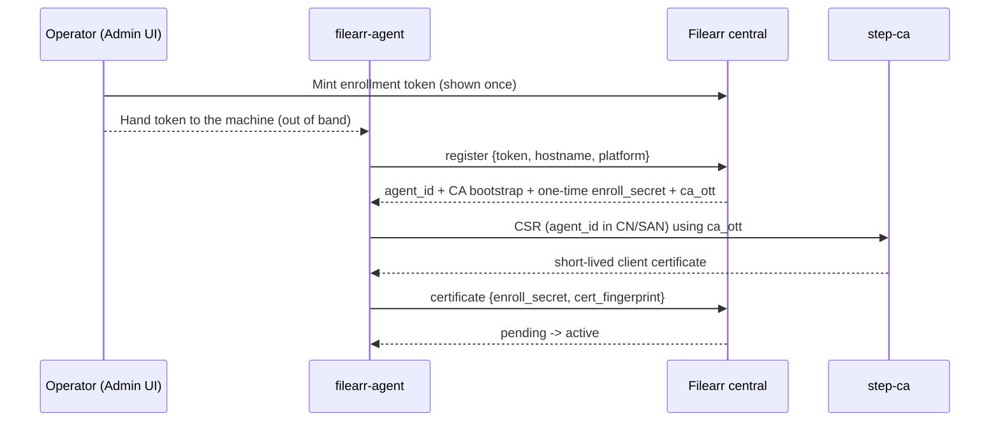

# Distributed agents

Filearr can coordinate a fleet of **distributed agents**: a small companion
program on each remote machine that scans *that host's* local disks, keeps a
**local, offline-usable** index, and replicates lightweight file-change events up
to the central server over mTLS.

!!! info "Agents are opt-in and off by default"
    A single-node Filearr deployment is entirely unaffected by any of this. With
    `FILEARR_AGENTS_ENABLED=false` (the default), the agent API returns 404, the
    Admin → Agents panel is hidden, and the certificate authority never runs. The
    tables still exist (empty), so enabling later needs no migration.

## What the agent is (and is not)

- **It is** an offline-first local catalog plus a reliable, at-least-once,
  idempotent replication client. Local search answers "where did I put that
  file" using path / size / mtime / hashes / filename-derived title.
- **It can also extract**, on its own machine, when policy turns it on: the
  agent runs the extraction pass locally and attaches the result to its change
  events. Central never opens a file on a remote host — extraction either
  happens *on the agent* or not at all for that item.
- **It is not** the place heavy or exotic extraction lives. Central remains the
  single source of truth; the agent's local index is disposable and rebuildable
  from a filesystem walk, exactly as Meilisearch is one level up.

The agent is a single static Go binary (no cgo), cross-compiled for Windows,
macOS and Linux, using a pure-Go SQLite/FTS5 store.

### Content extraction on agent-owned libraries {#agent-extraction}

Extraction on agent libraries is **opt-in and host-dependent**. It is off until
you enable it, and what an agent can actually do depends on which tools exist on
*that machine*, not on which binary it runs.

!!! warning "Agent extraction is off by default, and capability is per host"
    Replication carries **identity only** — path, size, mtime, hashes, plus a
    filename-derived title — until you set `extract_enabled` in the agent's
    policy. With it on, the agent ships a compact `extracted` object alongside
    each change event and central folds it into the item's *extracted* metadata
    (never `user_metadata`).

    **What still cannot work:**

    - **Central-side extraction never runs for agent items.** Central cannot
      open a path on a remote host. If the agent did not extract it, nothing
      will — there is no retrieve-then-extract fallback.
    - **A capability the agent host lacks is silently unavailable.** OCR needs
      `tesseract`, the media technical probe needs `ffprobe`, deep EXIF needs
      `exiftool`. These are **host tools on `PATH`**, not compiled-in features:
      an operator upgrades an agent's capability by installing a package on the
      machine, not by swapping binaries. An agent asked to do something it
      cannot logs the ignored setting once and carries on — and the console
      shows you exactly which agents those are (below).
    - **Oversize extractions are dropped, not retried.** Central caps the whole
      `extracted` object at `FILEARR_AGENT_EXTRACTED_MAX_BYTES` (256 KiB). Over
      that, the object is discarded with a warning and the change event still
      applies — replication is never allowed to wedge on enrichment.
    - **Not every format is covered yet.** PDF text, deep EXIF and the more
      exotic 3D formats are later phases; the agent advertises the `formats` it
      can actually handle.

    **How to turn it on:** set `extract_enabled: true` in the policy scope you
    want (Agents page → *Agent policy* → *Content extraction*), plus
    `extract_body_text` for document text and `extract_ocr` where the hosts have
    tesseract. Remember that a narrower scope **replaces** a broader one, so an
    `agent:` document must repeat every key it needs. Then install the host
    tools on the machines that need them. Existing items pick the new metadata
    up on their next change event or the next full reconcile; RAG chunking and
    content embeddings follow automatically once `body_text` lands, because the
    backfills select on exactly that.

    **What worked all along**: filename/path/size/date search and facets, hashes
    and duplicate detection, move detection, on-demand stat/rehash verification,
    file retrieval (the agent streams the bytes on request), and thumbnails —
    which the agent generates itself and pushes to central, precisely because
    central cannot read the source.

#### Seeing what an agent can do {#agent-capabilities}

Each agent reports a **capability advertisement** on its command poll — whether
this build has the extraction pass (`extract`, `extract_schema`), which host
tools it found (`tools.ffmpeg` / `ffprobe` / `tesseract` / `exiftool`), and the
`formats` it can handle. The Agents table exposes it per row behind
**details**, together with the agent's effective content-extraction policy and,
most usefully, a list of the settings **this agent will ignore** — for example
an amber `extract_ocr — no tesseract on the agent host` chip when the policy
asks for OCR on a machine that has none. The check is deliberately conservative:
an agent that has not yet advertised anything is reported as unknown rather than
flagged.

## Installing the agent (service + sidecar config)

The recommended install path starts from the **Agents page** in the central
console (`#/agents`): the *Enrollment & installer* card mints an enrollment
token and generates a ready-to-use `filearr-agent.json` **sidecar config** —
a plain, user-editable JSON file the agent picks up during install:

```json
{
  "central_url": "https://filearr.example.com",
  "enrollment_token": "fae_…",
  "agent_name": "",
  "config_group": "default",
  "log_level": "info"
}
```

**One-command install (recommended):** your central serves the agent binaries
for every platform itself (`/api/v1/agent-dist` — baked into the Docker image,
sha256-verified by the scripts, no GitHub access needed). Save the sidecar
into a folder and run, from that folder:

```bash
# Linux / macOS
curl -fsSL https://filearr.example.com/api/v1/agent-dist/install.sh | sh
```

```powershell
# Windows (elevated PowerShell)
irm https://filearr.example.com/api/v1/agent-dist/install.ps1 -OutFile install-agent.ps1
.\install-agent.ps1
```

No sidecar saved yet? Pass the enrollment token directly — the script writes a
minimal sidecar for you: `... | sh -s -- -t <token> [-n <name>]` on
Linux/macOS, `.\install-agent.ps1 -Token <token> [-Name <name>]` on Windows.
The scripts detect OS/arch, download the matching binary, verify its sha256
against the manifest, and hand off to the installer below. (`-d` /
`-DownloadOnly` fetches the binary without installing the service.)

### One-script Windows lifecycle (provision / update / reconfigure) {#windows-scripts}

The install script above still needs a token minted in the console first. For
zero-console automation, **your central serves a single lifecycle script,
pre-configured with its own URL** (also shown on the Agents page's installer
card; the repository copy at
[`scripts/manage-windows-agent.ps1`](https://github.com/pwsh/filearr/blob/main/scripts/manage-windows-agent.ps1)
is identical but needs `-CentralUrl`):

```powershell
irm https://filearr.example.com/api/v1/agent-dist/manage-windows-agent.ps1 `
    -OutFile manage-windows-agent.ps1
```

Run it from an **elevated** PowerShell; it auto-detects what the machine
needs:

- **Agent not installed → provision.** Mints an enrollment token through
  `POST /api/v1/agents/enrollment-tokens`, downloads + sha256-verifies the
  binary from agent-dist, installs the auto-start `filearr-agent` service
  (enrolls non-interactively), and applies the configuration switches.
- **Agent installed → update + reconfigure.** Compares `filearr-agent
  --version` against the agent-dist manifest and swaps the binary under a
  stopped service when they differ (previous binary kept as `.old` for manual
  rollback; `-Force` reinstalls regardless), applying configuration changes
  in the same window. With nothing to do, it says so and exits.

```powershell
# fresh machine: provision with scan locations (auth-off central — no key)
.\manage-windows-agent.ps1 -ScanRoot D:\media -ScanRoot E:\photos

# authenticated central: minting is an admin operation
.\manage-windows-agent.ps1 -ApiKey <admin key> -ScanRoot D:\media

# later, same machine: update to whatever central serves now
.\manage-windows-agent.ps1

# migrate to mTLS (± an update in the same run) — the per-machine half of
# the mode-flip runbook
.\manage-windows-agent.ps1 -MtlsUrl https://agents.example.com
```

Switches work on both paths: `-ScanRoot` (repeatable) merges into the
service's `scan.json` (presets/globs you added survive) and `-MtlsUrl`
rewrites the sidecar's `central_url` to the mTLS site — enrollment always
runs against the main URL (the mTLS site refuses clients without a
certificate yet), and the enrolled agent presents its client certificate
automatically after the switch. `-Name`, `-RolloutGroup`, and
`-TokenTtlMinutes` cover the rest of the mint surface.

!!! warning "mTLS switch needs an agent build from 2026-08-08 or later"
    Older daemons pinned the enrollment-time URL inside `state.json` and
    ignored a changed sidecar/env/flag entirely. Current builds adopt the
    configured URL at startup (the log shows *"central URL switched by
    config"*). Running the script with `-MtlsUrl` against an older install
    still works in **one run** — the binary updates first, and the new binary
    reads the switched sidecar when the service starts.

Downloads always ride `agent-dist`, the deliberately-unauthenticated
first-install surface, so updates never *require* a key — `-ApiKey` is sent
on every request for deployments that front central with an authenticating
proxy. As an updater this is the operator-driven complement to the built-in
[self-update channel](#self-update-with-signed-releases): use it for
key-pinned builds central won't offer unsigned bits to, machines with
self-update disabled, or an immediate "update now" from a shell.

**Manual install:** download the platform binary from
`<central>/api/v1/agent-dist` (the manifest lists every platform with its
sha256) and put it beside the sidecar in one folder, then (as admin/root):

```bash
filearr-agent install --config filearr-agent.json
```

`install` copies the binary into the platform's install location
(`%ProgramFiles%\Filearr Agent` on Windows; `/usr/local/bin` with config in
`/etc/filearr-agent`, data in `/var/lib/filearr-agent`, and logs in
`/var/log/filearr-agent` on Linux), enrolls non-interactively when a token is
present, and registers an **auto-starting system service with
restart-on-failure** (Windows SCM, systemd, or launchd). Re-running `install`
upgrades in place; `filearr-agent uninstall` removes the service and binary
(`--purge` also removes data/logs/config); `filearr-agent service
status|start|stop|restart` manages it day to day.

If the host previously ran the agent **manually** (identity under the user's
config dir, e.g. `%AppData%\Roaming\filearr-agent`), `install` **adopts** that
enrollment: the identity, local index, outbox, and scan config are copied into
the system data dir so the service continues seamlessly — no re-enroll, no
rescan, replication sequence preserved (the per-user copy is left untouched).
Install also **verifies the service actually stays running** and fails with
guidance if it exits immediately, instead of printing a success banner over a
dead service.

Service start reports **running immediately** and finishes initialization in
the background — necessary because the first start after an upgrade may
rebuild local database indexes over the whole catalog, which can take minutes
on a large index, longer than the Windows SCM's 30-second start budget. The
agent log carries an "opening local index" line while that runs; a fatal
init failure (bad data dir, unreadable index) logs and exits nonzero so the
service manager's restart/recovery policy applies.

The enrollment token in the sidecar is **one-shot**: after a successful
enroll the file is rewritten with the token removed and a consumption
timestamp in its place. Every other field stays user-editable; explicit CLI
flags and environment variables override sidecar values.

Logging is definable per install or per configuration group:
`error`, `warn`, `info`, `verbose`, `debug` — with rotating file logs
(10 MiB × 5, compressed) in the platform log directory.

## Running the agent in Docker (Unraid)

For NAS boxes — Unraid first among them — the agent also ships as a
standalone container: `ghcr.io/pwsh/filearr-agent`. The image bundles the
static agent binary, `ffmpeg` (for video poster thumbnails), and an
entrypoint that enrolls on first start, then runs the replication daemon
alongside interval rescans of your mounted shares.

!!! info "Why interval rescans, not watch mode"
    Unraid's `/mnt/user` is a FUSE (shfs) mount where inotify is unreliable —
    the same caveat that applies to SMB/NFS everywhere in Filearr. The
    container therefore re-walks its roots on a timer (default every 6 h;
    `FILEARR_AGENT_SCAN_INTERVAL`). Rescans are mtime+size cheap: unchanged
    files cost a `stat`, nothing more.

### Unraid setup

A Community Applications template ships in the repo
(`unraid/filearr-agent.xml`). Three fields matter on first start:

1. **Central URL** — your Filearr server (`https://filearr.example.com`).
2. **Enrollment token** — mint one in the console (Agents → *Mint token*);
   it is single-use and short-lived. After the log shows `enrolled.` the
   identity lives in appdata and the token field can be cleared.
3. **Scan roots** — comma-separated directories to inventory. Prefer listing
   specific shares (`/mnt/user/media,/mnt/user/documents`) over all of
   `/mnt/user`, which drags appdata/system churn into the catalog.

The template mounts `/mnt/user` **read-only and 1:1** (container path equals
host path), so the paths central records are your real Unraid paths — no
remote-path-mapping needed. If you narrow the mount to one share, keep it 1:1
(`/mnt/user/media` → `/mnt/user/media`) to preserve that property. The agent
runs as `PUID`/`PGID` 99/100.

!!! warning "Keep agent state OFF the FUSE layer"
    Agent state (`/config`) holds a SQLite index + replication outbox. Point
    it at a **cache-pool path** (`/mnt/cache/appdata/filearr-agent`, the
    template default) or an exclusive share — SQLite accessed through
    `/mnt/user`'s shfs/FUSE layer produces `database is locked` stalls.

**Share Map** (recommended): the container cannot discover your SMB exports
(there's no `smb.conf` inside it, and its hostname isn't your NAS's), so tell
it how each root is shared — one `localpath=location` pair per root:

```text
FILEARR_AGENT_SHARE_MAP=/mnt/user/media=smb://TOWER/media,/mnt/user/documents=smb://TOWER/documents
```

Central then renders clickable network-open links (`smb://` or `\\TOWER\…`,
per the viewer's OS) for every file this agent replicates. UNC and `nfs://`
locations work too; the longest matching prefix wins per file.

**Local web UI**: the template maps port 8686 and sets
`FILEARR_AGENT_WEBUI_ALLOW_REMOTE=true` (a loopback-only listener would be
unreachable through a Docker port mapping). It stays read-only search and is
**central-policy-gated** — enable *Local web UI* under **Local access
policy** on the central Agents page (fleet-wide; per-agent/per-group
overrides via `PUT /api/v1/agent-policies/<scope>`) or it serves nothing. Self-update is off inside the
container (`FILEARR_AGENT_SELF_UPDATE=false` in the image): updating means
pulling a new image, and the agent no longer logs the unpinned-key warning.

### Any other container host

```yaml
services:
  filearr-agent:
    image: ghcr.io/pwsh/filearr-agent:latest
    restart: unless-stopped
    environment:
      FILEARR_AGENT_CENTRAL_URL: https://filearr.example.com
      FILEARR_AGENT_TOKEN: "<single-use token>"   # remove after first start
      FILEARR_AGENT_NAME: nas-01
      FILEARR_AGENT_SCAN_ROOTS: /srv/media
    volumes:
      - ./agent-data:/config
      - /srv/media:/srv/media:ro
```

All `FILEARR_AGENT_*` environment variables pass straight through to the
binary; the data directory is pinned to `/config`.

!!! warning "Container updates replace self-update"
    The image ships with `FILEARR_AGENT_SELF_UPDATE=false`: the signed
    self-update channel is off (an image is immutable by design). Update by
    pulling the new image; the enrolled identity and local index in
    `/config` carry over.

!!! note "The agent web UI is a small console"
    Five read-only tabs: **Search** (category chips, sorting, CSV/JSON
    export), **Filters** (a filter builder over the same query grammar as
    the central console, with live preview), **Reports** (categories,
    unmapped extensions, largest files, duplicates, future-dated files —
    with CSV download), **Status** (agent version and a per-root table of
    items/size/last-scan statistics), and **Logs** (columnar
    time/level/message/details view with export).

!!! note "Web UI logs are the full multi-process log"
    The image sets `FILEARR_AGENT_LOG_DIR=/config/logs`: the daemon, every
    scan invocation, and the entrypoint each write a rotating log file
    there, and the web UI **Logs** tab merges them into one
    timestamp-ordered view (selectable depth, up to 5,000 lines back, via
    `/api/logs?limit=N`). `docker logs` continues to carry the same lines.

!!! tip "Poison files on network mounts"
    A corrupt or locked file on a FUSE/SMB/NFS mount can block reads
    forever, which used to freeze a scan at the same file every run. Hashing
    is now bounded per file by `FILEARR_AGENT_HASH_TIMEOUT_SECONDS`
    (default `300`, `0` disables): past the budget the file is cataloged
    unhashed and a WARN in the agent log names the path so you can repair or
    exclude it.

## Configuration groups (remote configuration)

Agents can be assigned to **configuration groups** managed on the Agents
page. A group carries typed settings delivered over the signed policy
channel (an edit invalidates agent caches immediately): log level, scan
selections, inventory settings, and an optional scan schedule. Scan
selections accept **predefined per-OS presets** (`user-documents`,
`user-media`, `user-profiles-full`, `downloads`, `server-data`) or explicit
path specs with environment-token expansion (`%USERPROFILE%`, `$HOME`, `~`),
multi-user globs (`/home/*/documents`), and regex include/exclude filters —
all expanded **on the agent**, never centrally. Presets resolve real
locations (Windows known folders — OneDrive-redirect aware; Linux XDG
`user-dirs.dirs`, locale-proof; macOS user folders) and exclude system
files, thumbnails, caches, and other junk by default. Cloud-placeholder
files (e.g. OneDrive online-only) are detected from attributes and **never
opened**, so an inventory can't accidentally hydrate a user's cloud drive.

### Group settings schema

Unlike a policy document, a group's `settings` object **rejects unknown
top-level keys** (422) — a typo can never silently no-op.

| Key | Type | Default | What it does |
| --- | --- | --- | --- |
| `log_level` | `error`\|`warn`\|`info`\|`verbose`\|`debug` | unset | Intended agent log level. **Not enforced yet** — see below. |
| `scan_selections` | list of selections (max 100) | unset | The folder sets the agent should walk. **Not enforced yet.** |
| `inventory` | object | unset | Inventory-collector configuration. **Not enforced yet.** |
| `scan_schedule_cron` | 5-field cron (agent-local time) | unset | Scan schedule for the group's members. |
| `web_ui_enabled` | bool \| null | null (inherit) | Lifted to the top-level policy key on delivery. |
| `local_access_enabled` | bool \| null | null (inherit) | Lifted to the top-level policy key on delivery. |
| `auth_required` | bool \| null | null (inherit) | Lifted to the top-level policy key on delivery. |

**`scan_selections[]`** — `preset` (one of `user-documents`, `user-media`,
`user-profiles-full`, `downloads`, `server-data`, `custom`, or null), `paths`
(path specs, max 200, ≤4096 chars, glob brackets/braces balance-checked),
`include_regex` / `exclude_regex` (max 200 each; compiled with Python `re` as a
typo gate — the agent's RE2 engine is the authority), and `enabled` (default
true). An all-empty selection is allowed so an operator can stage a disabled
scaffold.

**`inventory`** — `enabled` (bool, default false), `collectors` (free strings,
max 64 × 128 chars; central deliberately does not hard-code the vocabulary), and
the optional typed `permissions` block.

**`inventory.permissions`** (W7) — only takes effect when `"permissions"` is
*also* named in `collectors`; an admin must both name the collector and configure
it. Defaults make a first run highlight only explicit, non-baseline grants:

| Key | Type | Default | Notes |
| --- | --- | --- | --- |
| `enabled` | bool | `false` | Opt-in. |
| `resolve_names` | bool | `true` | Best-effort SID/uid → display name. |
| `include_inherited` | bool | `false` | Off = explicit (non-inherited) ACEs only. |
| `include_effective_access` | bool | `false` | **Reserved for v2** — the agent no-ops on it until shipped. |
| `exclude_well_known` | bool | `true` | SYSTEM, Administrators, root, Everyone, CREATOR OWNER. |
| `exclude_principals` | list[str] | `[]` | Canonical ids, max 64 × 128 chars. |
| `collect_share_acls` | bool | `false` | Windows-only share-level ACLs. |
| `audit` | object \| null | null | Change-audit block, below. |

**`inventory.permissions.audit`** — `enabled` (bool, default false),
`retain_snapshots` (int 1..1000, default 10), `alert_on_change` (bool, default
false), `watch_paths` (path specs, max 200). Central validates and stores this
ahead of the collector; the snapshot-diff and alert routing are agent-side
scaffold.

The console's group dialog covers all of the above; the permissions and audit
blocks sit behind an **Advanced** disclosure and are omitted from the saved
document entirely unless you tick "include" — so "never configured" stays
distinguishable from "configured, all off".

!!! warning "Stored and delivered, but not acted on yet"
    `log_level`, `scan_selections` and everything under `inventory` are
    validated, versioned, and pushed to the agent, but **no shipped agent build
    reads them yet** — the collectors and the selection-driven scan are agent-side
    scaffold, and the agent's log level still comes only from its sidecar config,
    `FILEARR_AGENT_LOG_LEVEL`, or the `-log-level` flag. The console marks these
    fields with a *not enforced yet* chip. Authoring them now is safe and
    forward-looking; it changes nothing on the fleet today. `scan_schedule_cron`
    and the three local-access gates **are** live.

## Inventory commands (extensible, no redeploy)

Beyond media scanning, agents accept generic **inventory commands**: a
composition of *collectors* over a preset or path selection. Built-in
collectors: `stat` (sizes/timestamps), `owner` (POSIX uid/gid or Windows
owner account), `perms` (POSIX mode + xattr names, or a compact Windows ACL
summary), and `placeholder` (cloud-placeholder detection). Each agent
advertises the collectors it supports, and new **compositions** — for
example adding permission enumeration to a documents sweep — need no agent
redeployment; genuinely new collectors arrive through the signed self-update
channel. Results return inline for small runs or as a compressed upload for
large ones, always with a summary (roots expanded, entries, access-denied
count, placeholders skipped, per-collector errors).

## Fleet health and transport {#fleet-health}

Each agent attaches a compact **self-reported health snapshot** to its
command poll (every ~60 s): uptime, replication backlog (outbox events not
yet sent), local index size, and the live/last scan state. Central stores it
verbatim (size-capped) with an arrival stamp, and the Agents page shows it in
the online/last-seen tooltip — so "is that agent actually doing anything?" is
answerable without shelling into the machine. Older agent builds simply send
none; nothing breaks.

The poll also carries the agent's **running version**, so the console stays
current even for agents whose self-update subsystem is off — the container
image disables it by design, and before this the update poll was the only
version-confirmation channel, leaving container agents' console version
frozen at whatever they enrolled with.

Next to it, a **transport badge** shows `mTLS` or `bearer` per agent. This is
*central's* observation of which authentication path the agent's last
request actually used — deliberately not self-reported, so it's the honest
signal for the [mTLS migration](security.md): flip
`FILEARR_AGENT_AUTH_MODE` to `mtls-header` only once every active agent wears
the `mTLS` badge.

## Suspending an agent and agent-side maintenance {#agent-suspend-maintenance}

Two agent-scoped commands ride the same command-poll channel (Agents page →
per-row actions), applied at the agent's next check-in (~1 min):

- **suspend / resume** (`suspend`) — the agent stops its own scan scheduling
  and replication push until resumed. It keeps polling for commands, renewing
  its certificate, and reporting health (otherwise it could never be resumed
  remotely). The flag is persisted on the agent (`suspend.json` in its data
  dir), so it survives restarts. The applied truth is self-reported back via
  the health snapshot: the row wears a `suspended` badge once the agent
  confirms. Rapid toggling is safe — a still-pending suspend command is
  collapsed to the latest desire rather than queueing a contradictory backlog.
- **maintain** (`agent_maintenance`) — one local cleanup pass on the agent:
  compact the local index (`VACUUM` + WAL truncate), prune outbox rows already
  replicated *and acknowledged* past a 7-day retention (unsent rows and the
  newest row are never touched, so replication and the rebuilt-index signal
  are unaffected), and sweep stale temp files (atomic-write leftovers, aborted
  update downloads) older than a day. The result — bytes reclaimed, rows
  pruned, per-pass errors — lands in the command history. 409 while one is
  already queued or running.

Separately, when **central** enters [maintenance mode](operations.md#maintenance-mode),
every agent observes it on its next command poll and pauses its replication
push on its own (`backing off` badge) — local scanning and inventory continue,
and the outbox backlog drains as soon as the mode lifts. Older agent builds
that don't understand the advertisement are throttled by the replication
endpoint instead (503 + Retry-After feeding their normal flush backoff);
either way nothing is lost — the outbox is durable and resends from the same
sequence number.

## Enrollment walkthrough

Enrollment follows a **register-first** trust model: registration precedes
certification, and **no certificate is ever issued before registration**.



Step by step:

1. **Mint a token.** Admin → Agents → **Mint token** (or `POST
   /api/v1/agents/enrollment-tokens`, admin scope). The raw token is shown
   **once** and never stored — only its hash is persisted. Tokens are
   **single-use** and short-lived (`FILEARR_ENROLLMENT_TOKEN_TTL_MINUTES`,
   default 60 — minutes-to-hours, never days). Hand it to the machine out of band.
2. **Register.** On the device:

    ```bash
    filearr-agent enroll -central https://filearr.example.com -token <paste> -name <name>
    ```

    (Hostname defaults to the machine's own.) Central validates and **consumes**
    the token, assigns the authoritative `agent_id`, and returns CA bootstrap
    info, a one-time `enroll_secret`, and a short-lived, single-use `ca_ott`
    (the step-ca token for the next step). The agent is now **pending**.
3. **Get a certificate.** The agent generates a keypair and CSR embedding its
   `agent_id`, and uses the `ca_ott` to obtain a short-lived client cert directly
   from step-ca. Keys never leave the agent; central never proxies the CSR.
4. **Bind the cert.** The agent posts its cert fingerprint with the
   `enroll_secret`; central moves it from **pending** to **active**.

Then start scanning and (optionally) the daemon:

```bash
filearr-agent scan --root <media path>   # repeatable
filearr-agent run                        # replication + policy + self-update daemon
```

Run `filearr-agent run` under a service manager with restart-on-failure (systemd
`Restart=on-failure`, a Windows Service failure action, or launchd `KeepAlive`).

## Replication: the outbox / seq contract

The agent writes each local change and an outbox row in the **same** local
transaction. A drain goroutine reads unsent rows in `seq_no` order, batches them
(by size or age), and POSTs them to central's replication endpoint, marking them
sent only when central ACKs the exact sequence range. If central reports a gap
(it expected a different `seq_no`), the agent rewinds and re-sends — so
replication is **at-least-once and idempotent**, and never drops or half-applies
a change. When offline, the outbox blocks (never drops).

What a replication event carries (the "R1" field set):

- `rel_path`, `size`, `mtime`, `quick_hash`, `content_hash` (content hash may be
  null for large/networked files), and an optional best-effort `share_hint`.
- A `moved` event is a delete+create pair carrying the old path.

The filename-derived title stays **agent-local**; full metadata extraction
happens centrally after the item is replicated. See
[Data collected & how](data-collection.md#what-agents-replicate) for exactly what
leaves the agent machine — and what never does.

## Reconciliation

Beyond the incremental outbox, the agent periodically (and after long offline
periods) pages its **whole manifest** to central for a full-manifest diff. Central
does a server-side anti-join to catch anything the incremental stream missed
(e.g. a deletion during a long outage). This is the safety net behind
replication, analogous to the central Postgres↔Meilisearch reconcile sweep.

## Policy keys

Central pushes a per-scope **policy** the agent polls (with ETag) and applies
within one poll interval. The policy controls which libraries/paths the agent
scans, preset exclude bundles, and the local-access flags below. mTLS is the only
integrity layer on this channel; there is no separate payload signing (a single
operator is the sole policy author). Policy is **advisory-by-asymmetry**: central
can *disable* a local capability and the agent honors it on next poll, but
central cannot reach into the agent to read local-only data.

### Scopes, and why they replace rather than merge {#policy-scopes}

A policy document is written at one of three scopes:

| Scope string | Applies to |
| --- | --- |
| `global` | every agent |
| `group:<rollout_group>` | agents whose enrollment put them in that **rollout group** (not the same thing as a *configuration group*) |
| `agent:<uuid>` | one agent |

Resolution is **most-specific-wins**: `agent:` beats `group:` beats `global`.

!!! danger "The winning scope supplies the WHOLE document"
    There is **no key merging**. If an agent has an `agent:` document, that
    document *is* its policy — every key the `global` document was providing
    simply stops applying, and the agent falls back to its **built-in default**
    for those keys, not to the broader scope. A narrower document must therefore
    carry every key it needs. This is the single most surprising property of the
    channel; the console shows exactly which keys a save would stop applying
    before you confirm it.

Writes are **append-only versions** — a `PUT` inserts a new row at
`version = prior max + 1` and never mutates history.

### Every policy key

All keys are optional; **absent means "inherit-or-default"**, which is not the
same as `false`. "Enforced by" says who actually acts on the value.

| Key | Type | Absent = | Enforced by | What it controls |
| --- | --- | --- | --- | --- |
| `presets` | list[str] | agent's built-in preset defaults | agent | Named exclusion bundles applied while walking. Validated against central's preset catalogue (`GET /api/v1/presets`). |
| `include_globs` | list[str] | no include filter | agent | Only matching paths are cataloged. |
| `exclude_globs` | list[str] | presets only | agent | Extra excludes on top of the preset bundles. |
| `content_hash_max_bytes` | int ≥ 0 | agent's built-in cap | agent | Files larger than this are cataloged unhashed; `0` disables content hashing. |
| `watch_mode` | bool | off (polling) | agent | Filesystem-event watching. Local disks only — inotify is unreliable over SMB/NFS. |
| `extract_enabled` | bool | **off** | agent | Run the agent-side [content-extraction pass](#agent-extraction) and ship the result with each change event. Off = identity-only replication, and the three keys below do nothing. |
| `extract_body_text` | bool | **off** | agent | Include document body text (txt/md/docx/xlsx/odf/epub…). This is what makes agent items chunkable and content-embeddable rather than filename-only — and what makes events materially larger. |
| `extract_ocr` | bool | **off** | agent | OCR images and scanned PDFs. **Needs `tesseract` on the agent host**; an agent without it logs the ignored setting and continues. |
| `extract_max_bytes` | int ≥ 0 | agent's built-in cap (32 MiB) | agent | Skip extraction for files larger than this. The identity half of the event is unaffected; `0` = extract nothing. |
| `scan_cron` | 5-field cron | no cron schedule | agent | In-daemon scan schedule in **agent-local time**. Wins over `scan_interval_seconds`. |
| `scan_interval_seconds` | int ≥ 300 | no interval schedule | agent | Fixed-interval scanning; ignored when `scan_cron` is set. |
| `scan_on_start` | bool | off | agent | One scan ~30 s after the daemon starts. |
| `poll_interval_seconds` | int 60..86400 | agent's built-in interval | agent | How often the agent polls central. Longer intervals delay every setting here. |
| `reconcile_interval_seconds` | int ≥ 300 | 24 h | agent | Full-manifest reconciliation cadence. |
| `upload_rate_bytes_per_sec` | int ≥ 0 | unlimited | agent | Token-bucket ceiling for staged uploads; `0` = unlimited. Read at upload **start**, so a change applies to the next upload, not one in flight. |
| `local_access_enabled` | bool | **on** | agent | The on-device `filearr query` CLI socket. An explicit `false` persists through offline periods (the policy is cached). |
| `web_ui_enabled` | bool | **off** | agent | The local read-only web UI. A never-contacted agent serves nothing. |
| `auth_required` | bool | **on** | agent | Whether the local web UI demands its bootstrap token. Never affects the CLI peer-credential check. |
| `offline_grace_seconds` | int ≥ 0 | 86400 (24 h) | agent | How long a cached policy stays trusted offline. Past it the web UI fails closed; the CLI keeps answering. |
| `path_scope` | list[str], max 1000 | unrestricted | agent | OR-combined `rel_path` GLOB allow-list applied to every **local** result set. |
| `read_only` | bool | true | agent | **Always `true`.** The local surface is read-only by invariant; a `false` is rejected with a 422 rather than normalised. Not editable in the console. |
| `auto_update` | bool | on | **central** | Whether central *offers* an update on this agent's update-manifest poll (the poll answers `204` when off), so it gates every agent build uniformly — including old ones. An operator-triggered update from the agents table bypasses it: the click *is* the authorization. |

Two more keys appear in a delivered document but are **not operator-settable**:

- `taxonomy_version` — injected by central per response so a taxonomy edit
  invalidates the agent's cache. Writing it has no effect.
- `group` — where the assigned *configuration group*'s settings ride. An
  operator-authored top-level `group` key **suppresses the config-group fold
  entirely** (it is never clobbered), so don't author one unless you mean it.

Unknown keys are **preserved verbatim**: the schema is `extra="allow"` and the
row stores the submitted body as-is, so an older central can never strip a newer
agent's key. The console re-emits keys it does not model rather than dropping
them, and lists them for you.

### Editing policy in the console

The Agents page carries a full **Agent policy** editor:

- a **scope selector** (Global / Rollout group / Specific agent) that loads that
  scope's stored document, or tells you it has none and what it inherits today;
- a grouped, **tri-state** form for every key above — *Inherit (not set)* versus
  an explicit value — so you never accidentally write `false` where you meant
  "say nothing";
- a **replacement warning** on any non-global scope, naming the exact keys a save
  would stop applying;
- an **"effective now"** column when a specific agent is selected, showing the
  value that agent actually has and which document supplied it (agent policy /
  rollout-group policy / global policy / config group / agent default), from
  `GET /api/v1/agent-policies/effective/{agent_id}` (admin scope). That endpoint
  mirrors the agent-plane resolution exactly, minus the injected
  `taxonomy_version`, and never stamps the agent's `last_seen_at`;
- a **raw JSON** escape hatch that round-trips forward-compat keys;
- a read-only **recent versions** list per scope.

Setting a key is only half the story for anything host-dependent. Expand an
agent's **details** row in the agents table to see its
[capability advertisement](#agent-capabilities) — extraction support and
schema, the `ffmpeg` / `ffprobe` / `tesseract` / `exiftool` matrix, the supported
`formats` — next to its effective content-extraction policy, plus an explicit
list of the settings **that agent will ignore** and why. That is the answer to
"I turned OCR on fleet-wide; why is nothing happening on this box".

### Scan scheduling from policy (service installs)

A service-managed `filearr-agent run` schedules its own scans — no external
Task Scheduler or cron entry to lose across reinstalls. Set `scan_cron`
(5-field cron, agent-local time), `scan_interval_seconds` (≥300; cron wins if
both are set), and/or `scan_on_start` (one scan ~30 s after start) in the
agent's policy, or `scan_schedule_cron` in a config group. All absent =
scheduler off. Scans run as a child process of the daemon (identical to a
hand-run `filearr-agent scan`, crash-isolated), never overlap, and a policy
edit takes effect on the next poll without a restart. Container deployments
keep using the entrypoint's `FILEARR_AGENT_SCAN_INTERVAL` loop instead —
don't enable both.

## Local query CLI, local web UI, and the frecency privacy note

The agent exposes a **local, offline** query surface so search works even when
the machine is disconnected from central:

- **CLI** — `filearr query 'kind:video size:>1G modified:<7d'`. A `filearr`
  alias/symlink to the binary gives the branded verb.
- **Local web UI** — a minimal, **read-only** search page the `run` daemon can
  serve. It is **loopback-only** (default `127.0.0.1:8686`; a non-loopback bind
  is refused), **GET/HEAD-only**, Host-header allow-listed (DNS-rebinding
  defense), CSRF-protected, and gated by a one-time bootstrap token printed to the
  log (Jupyter-style), exchanged for an `HttpOnly`, `SameSite=Strict` session
  cookie. It is **policy-gated and fails closed**: it serves only while central
  policy enables it *and* the cached policy is fresh; a never-contacted agent
  starts with it off.

!!! note "Local search history never leaves the machine"
    The agent can rank your recent queries (zoxide-style frequency + recency) to
    offer suggestions. This history lives in a **separate** local database file
    from the index/outbox. The replication subsystem is only ever handed the
    index store's handle, so it is *incapable* of touching a history row — the
    isolation is architectural, not merely policy-gated. Central holds no copy;
    wiping the agent's data directory erases the history with no way to restore it.

## Self-update with signed releases

Agents self-update from an **operator-signed manifest**. Central stores and serves
the manifest and artifacts but is **untrusted for update integrity** — it cannot
re-sign a manifest, so a compromised central cannot push a wrongly-signed binary.

- The **signing private key lives only on your signing machine** (default
  `~/.filearr-signing`), backed up to a vault, never committed, never on central.
- The matching **public key is pinned into the agent binary at build time**
  (`-ldflags`). A binary built **without** the pin refuses every signed
  release (it can still follow the central-version channel below). The pin
  accepts **two comma-separated keys** (current + next), so key rotation —
  including moving the key onto a YubiKey or KMS — rolls through the normal
  update channel instead of rebuilding the fleet.
- Each release is Ed25519-signed over a canonical manifest; the agent re-derives
  the canonical bytes and verifies before swapping.

**Rollout is staged:** a signed manifest lands as `canary` and is offered only to
agents in the canary rollout group; once the canary wave confirms healthy, an
operator **promotes** it to the whole fleet.

**Rollback is automatic:** a newly swapped binary is on trial — it writes a boot
counter and runs a 60-second health window on each launch. On pass it clears the
counter and confirms its version. If it crashes through 3 launch attempts without
passing, the next launch **restores the previous binary** and re-execs it. A
sha256 mismatch, an invalid signature, or an unpinned build all refuse the update
rather than swapping.

See [Security → Signed agent updates](security.md#signed-agent-updates) for the
key-handling contract.

## Tracking the central version (auto-update)

Central also compares every agent's reported version against its **own
published version** — the agent binaries baked into the central Docker image
(the same ones the install scripts serve). When they differ and no signed
release applies, the agent's periodic update poll is offered a manifest built
from those baked binaries, so **deploying a new central image is all it takes
for the fleet to follow it**:

- **Unsigned by design, split by trust:** builds installed via the central
  install scripts carry no signing-key pin — for them the authenticated TLS
  channel + sha256 is the trust root (exactly what their original install
  used), and they accept this channel (with a logged warning). A key-pinned
  build refuses unsigned bits and tells central so; it updates only through
  the signed-release flow above.
- **`auto_update` policy (staged rollout):** the offer is gated server-side by
  the agent-policy key `auto_update` (absent = on). Set it `false` globally
  and enable it per rollout-group or per-agent to stage a rollout — or leave
  it on and stage with canary releases. Remember policy scopes replace, they
  don't merge.
- **Console badge + button:** the Agents page shows **"update available"**
  next to any agent whose version differs from what central would offer, with
  an **update** action that queues the update for the agent's next check-in
  (~1 minute). While queued the badge reads **"update queued"**; agents that
  are current show neither. A manual trigger works even when `auto_update` is
  off — the click is the authorization. The same boot-counter health window +
  automatic rollback applies to every channel.

## Transfers / retrieve flow

Central can ask an agent to do one thing on demand through an **agent commands**
queue: a cheap `stat_check` (existence/freshness), a stronger `rehash_check`
(re-read the quick/content hash to verify), or a `stage_upload` that starts an
agent→central **retrieve**. A retrieve stages the file to central's writable disk
(never a media mount) as a resumable, chunked upload, from which it can be
downloaded within a TTL. Offline is the normal case, so a retrieve waits patiently
and the staged file survives to be (re-)downloaded within its window.

## Share-location hints and admin mappings

An agent reports a best-effort network-share hint for the items it owns (a
`share_url` / UNC / host, marked as agent-sourced). This is advisory — anonymous
shares, permission-scoped enumeration, and multi-homed hosts mean many agents
report nothing — and falls through to a central share mapping when absent, so the
"open on the network" hint works even when an agent can't discover its own share.

## Agent thumbnails

Agents can generate thumbnails locally and upload them (JPEG, size-capped) so the
central grid has a preview for agent-hosted items without retrieving the whole
file. ffmpeg is optional on the agent for video poster frames; without it, image
thumbnails still work.

**ffmpeg + service installs**: a Windows service runs with the SYSTEM
environment and never sees a *user* PATH — where most ffmpeg installers
(winget included) put themselves — so "ffmpeg works in my terminal" routinely
doesn't hold inside the service process. Point the agent at the binary
explicitly with `"ffmpeg_path": "C:\\path\\to\\ffmpeg.exe"` in the sidecar
config (`filearr-agent.json`, read on every service start), or set
`FILEARR_AGENT_FFMPEG_PATH` as a **system** environment variable. Env wins
over sidecar; both win over the PATH lookup. Restart the service after
either change.

## Killing an agent: revoke vs delete

- **Revoke** (Admin → Agents → revoke, or `DELETE /api/v1/agents/{id}`) is an
  application-layer denylist: the agent is refused on every replication/config
  request regardless of whether its short-lived cert is still cryptographically
  valid. The row and its replication history are kept. Combined with the short
  (24–72h) cert TTL and refuse-to-renew, this bounds a stolen-cert blast radius
  without running CRL/OCSP.
- **Hard delete** (`DELETE /api/v1/agents/{id}?purge=true`) removes the row
  entirely — the cleanup path for failed-enrollment pending rows and
  decommissioned machines with no data footprint. It is refused (409) while any
  library or item still references the agent.

For CA setup, the null-`ca_ott` failure class, and re-enrollment recovery, see
[Operations → agent enrollment / CA](operations.md#agent-enrollment-ca-step-ca-failures).
